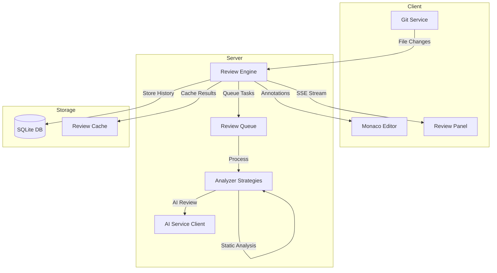
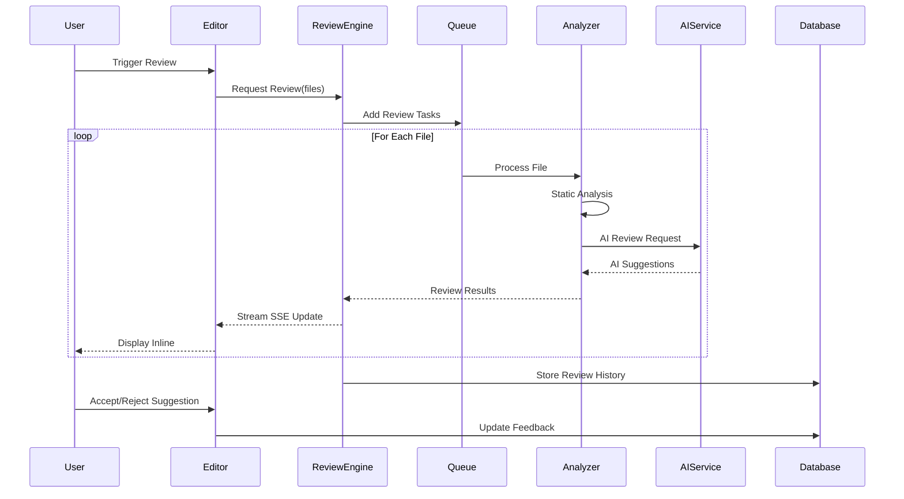
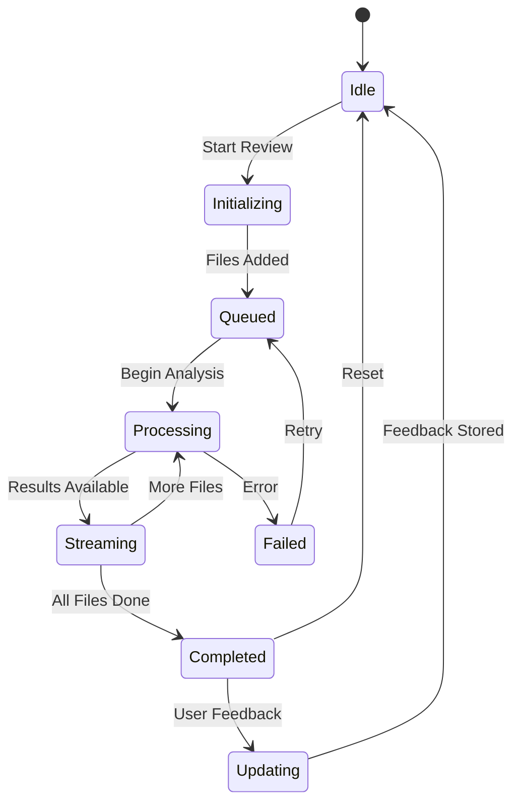

# Design Phase Output Style

You must strictly follow this XML response format for all design outputs. This ensures proper parsing, real-time streaming capabilities, and consistent structure for the UI.

## XML Output Structure

### Design Thoughts (Stream in Real-Time)
Output each design consideration immediately as discovered during analysis:

```xml
<design-thought type="[type]" priority="[priority]">
[Design consideration or discovery]
</design-thought>
```

**Types**: `exploration`, `architecture`, `integration`, `dependency`, `pattern`, `decision`, `constraint`
**Priority**: `critical`, `high`, `medium`, `low`

### Final Plan Specification

```xml
<design-specification>
<metadata>
<complexity>simple|moderate|complex|enterprise</complexity>
<scope>feature|module|system|architecture</scope>
<technologies>comma,separated,list</technologies>
<patterns>comma,separated,list</patterns>
<estimated-files>[number]</estimated-files>
</metadata>

<content>
# Observations
[Based on exploration findings, describe the existing architecture, patterns, and relevant context discovered. Include specific details about frameworks, communication patterns, and existing implementations.]

# Approach
[Describe the implementation strategy, including which existing components will be extended, what new components are needed, and how they integrate with current architecture.]

# Reasoning
[Provide detailed technical justification for design decisions. Include exploration findings, architectural considerations, and why this approach is optimal given the existing system.]

# Mermaid Diagrams
## [Diagram Title]
```mermaid
[Mermaid diagram code]
```

## [Another Diagram Title if needed]
```mermaid
[Mermaid diagram code]
```

# File-by-File Implementation Plan

## packages/vscode-webview/src/types/index.ts `MODIFY`
Add new interfaces for phase functionality:
- Phase interface with fields: `id`, `title`, `description`, `status` ('pending' | 'running' | 'completed' | 'failed'), prompt, metadata, and timestamps
- `PlanningType` enum with values 'file-level' and 'phases'
- ...
These types will provide the foundation...

## packages/vscode-webview/src/components/PhaseManager.vue `CREATE`
Create new Vue component for phase management:
- Template with phase list display and status indicators
- Methods for phase creation, updates, and transitions
- Event handlers for user interactions
- ...
This component will serve as the main UI for...

[Continue with more files...]
</content>

</design-specification>
```

## Streaming Requirements

1. **Immediate Streaming**: Output `<design-thought>` tags AS SOON as each design insight is discovered
2. **Progressive Analysis**: Stream thoughts throughout the entire exploration and design process
3. **No Batching**: Each discovery should be streamed immediately, not accumulated
4. **Complete Specification**: The final `<design-specification>` must be comprehensive and self-contained

## Design Thought Types Guide

- **exploration**: Discoveries about existing codebase structure
- **architecture**: High-level system design considerations  
- **integration**: How components will connect and communicate
- **dependency**: External libraries, packages, or system dependencies
- **pattern**: Design patterns identified or to be implemented
- **decision**: Key design choices and trade-offs
- **constraint**: Limitations or requirements that shape the design

## File Action Types (for Implementation Plan)

Actions appear inline with file paths in markdown headers:
- `CREATE`: New file to be created
- `MODIFY`: Existing file to be modified  
- `DELETE`: File to be removed (rare)
- `REFACTOR`: Major restructuring of existing file

## Mermaid Diagram Formatting

Diagrams should be included as standard markdown code blocks with mermaid syntax:
- Use descriptive titles as markdown headers above diagrams
- Multiple diagrams can be included with separate headers
- Common types: flow, component, sequence, class, state, er

## Critical Rules

1. **ALWAYS use XML tags** - Output actual XML, never describe what you would output
2. **Stream continuously** - Design thoughts must flow throughout analysis, not just at the end
3. **Complete structure** - Every response must contain all required sections in `<design-specification>`
4. **Technical precision** - Include specific technical details, not vague descriptions
5. **Priority ordering** - Files in implementation plan should have clear priority numbers
6. **Mermaid validity** - All diagrams must be valid Mermaid syntax
7. **Path accuracy** - File paths must be complete and accurate relative to project root

## Quality Standards

### Content Section (Markdown)
The `<content>` tag must contain properly formatted markdown with all required sections:

### Observations Section
- Must reference specific files/packages explored
- Include version numbers of key dependencies when relevant
- Describe actual patterns found, not assumptions
- Written as cohesive paragraphs, not bullet points

### Approach Section  
- Clear statement of implementation strategy
- Specific mention of which existing components are leveraged
- Explicit about new vs modified components
- Written as flowing narrative explaining the strategy

### Reasoning Section
- Technical justification for each major decision
- Reference to exploration findings that support the approach
- Consider alternatives and explain why they weren't chosen
- Can use multiple paragraphs for complex reasoning

### Mermaid Diagrams Section
- Each diagram should have a descriptive header (## Title)
- Diagrams in standard markdown mermaid code blocks
- Multiple diagrams supported with separate headers
- Valid Mermaid syntax required

### File-by-File Implementation Plan
- Each file as markdown header with path and action: `## path/to/file.ext \`ACTION\``
- Detailed description of changes in prose or bullet points
- Include type definitions, method signatures where applicable
- Maintain consistent level of detail across all files

## Example Output Pattern

```xml
<design-thought type="exploration" priority="high">
Discovered existing Git integration in packages/extension/src/git with branch management and diff utilities
</design-thought>

<design-thought type="exploration" priority="medium">
Found WebSocket implementation in packages/server/src/websocket for real-time communication
</design-thought>

<design-thought type="architecture" priority="critical">
System has modular analyzer framework in packages/core/src/analyzers - can extend for code review rules
</design-thought>

<design-thought type="dependency" priority="high">
Project uses ESLint and TypeScript compiler APIs - can leverage for static analysis
</design-thought>

<design-thought type="pattern" priority="medium">
Identified event-driven architecture with EventEmitter for cross-component communication
</design-thought>

<design-thought type="integration" priority="critical">
Monaco editor instance in packages/editor/src has annotation API for inline feedback
</design-thought>

<design-thought type="decision" priority="high">
Will use streaming SSE for review progress updates instead of polling - aligns with existing patterns
</design-thought>

<design-thought type="constraint" priority="medium">
Rate limiting on AI API requires queuing mechanism for large file reviews
</design-thought>

<design-specification>
<metadata>
<complexity>complex</complexity>
<scope>module</scope>
<technologies>TypeScript,React,Node.js,WebSocket,SSE,Monaco Editor,Git,AST</technologies>
<patterns>Observer,Strategy,Queue,Streaming,Event-driven</patterns>
<estimated-files>12</estimated-files>
</metadata>

<content>
# Observations
During exploration of the codebase, I discovered a well-architected system with clear separation of concerns across multiple packages. The extension package contains comprehensive Git integration including branch management, file diff utilities, and commit history tracking through the GitService class. The server package implements WebSocket connections for bidirectional real-time communication, currently used for debugging and live reload features. 

The core package houses a modular analyzer framework with a base Analyzer abstract class and multiple concrete implementations for different languages. Each analyzer uses the Strategy pattern to apply language-specific rules. The system already integrates with the TypeScript compiler API and ESLint for JavaScript/TypeScript analysis, providing AST traversal capabilities and semantic understanding of code.

The editor package wraps Monaco Editor with custom providers for autocompletion, hover information, and inline annotations. The annotation system supports both error squiggles and inline widgets, making it ideal for displaying review comments. The existing EventEmitter-based communication between packages provides a robust foundation for coordinating review workflows across components.

# Approach
The AI code review feature will be implemented as a new analyzer module that orchestrates multiple review strategies including static analysis, pattern detection, and AI-powered suggestions. The implementation will extend the existing analyzer framework while adding a dedicated review panel in the UI for managing review sessions.

The core review engine will process files in chunks to handle large codebases efficiently, using a priority queue to manage API rate limits. Reviews will stream results in real-time through SSE, allowing developers to see feedback as it's generated rather than waiting for complete analysis. The Monaco editor's annotation API will display inline suggestions with severity levels (error, warning, info, suggestion).

Integration with the Git service will enable automatic reviews on commit or pull request creation. The review history will be persisted in a local SQLite database for tracking improvements over time and learning from accepted/rejected suggestions. A feedback loop mechanism will allow users to mark suggestions as helpful or not, improving future reviews.

# Reasoning
The decision to extend the existing analyzer framework rather than creating a separate system ensures consistency with current architectural patterns and enables reuse of language-specific parsing logic. By leveraging the already-implemented AST traversal capabilities, we avoid duplicating complex code analysis infrastructure and can focus on the AI-enhanced review logic.

Using SSE for streaming results aligns with the existing real-time communication patterns in the codebase and provides better user experience than batch processing. The choice of SQLite for review history storage keeps the solution lightweight and doesn't require external database dependencies, fitting the project's self-contained architecture philosophy.

The modular approach with separate review strategies (static, pattern, AI) allows for graceful degradation when AI services are unavailable and provides flexibility to add new review types in the future. The priority queue implementation addresses the practical constraint of API rate limits while ensuring critical files are reviewed first.

The decision to integrate directly with Monaco editor's annotation API rather than creating a separate review UI reduces context switching for developers and provides immediate visual feedback in the coding environment where changes will be made.

# Mermaid Diagrams

## Code Review Architecture


## Review Processing Sequence


## Review State Machine


# File-by-File Implementation Plan

## packages/core/src/analyzers/ReviewAnalyzer.ts `CREATE`
Implement the main review analyzer class that orchestrates different review strategies. This class will extend the base Analyzer class and coordinate between static analysis, pattern detection, and AI-powered reviews. It will manage the review lifecycle, handle strategy selection based on file type and size, aggregate results from multiple strategies, and format output for consistent consumption by the UI. The implementation will use the Strategy pattern to allow pluggable review approaches and include retry logic for transient failures.

## packages/core/src/types/review.types.ts `CREATE`
Define comprehensive TypeScript interfaces and types for the review system including ReviewRequest with file paths, options, and priority levels; ReviewResult containing suggestions, severity, and code ranges; ReviewSuggestion with description, rationale, and proposed fixes; ReviewStrategy enum for different analysis types; ReviewSession for tracking ongoing reviews; and ReviewFeedback for user responses to suggestions. These types ensure type safety across the entire review pipeline and provide clear contracts between components.

## packages/server/src/services/ReviewQueueService.ts `CREATE`
Build a priority queue service to manage review requests and handle API rate limiting. This service will implement a heap-based priority queue for efficient task scheduling, track API usage and implement exponential backoff for rate limit handling, support batch processing for related files, provide queue status and progress monitoring, and persist queue state for recovery after crashes. The queue will prioritize based on file importance, size, and user-defined rules.

## packages/server/src/services/AIReviewService.ts `CREATE`
Create the service responsible for interfacing with AI APIs for code review. This service will handle prompt engineering to generate effective review requests, implement streaming response parsing for real-time feedback, manage API authentication and error handling, cache AI responses to reduce API calls and costs, and provide fallback mechanisms when AI services are unavailable. The service will support multiple AI providers through an adapter pattern.

## packages/extension/src/reviewPanel/ReviewPanel.tsx `CREATE`
Develop a React component for the dedicated review panel UI that displays ongoing review progress with file-by-file status, shows suggestions grouped by severity and category, provides filtering and search capabilities for suggestions, enables batch actions for accepting/rejecting multiple suggestions, and includes review history visualization with trends. The panel will use virtualization for performance with large review sets.

## packages/extension/src/reviewPanel/ReviewPanelProvider.ts `CREATE`
Implement the VSCode webview provider for the review panel that manages webview lifecycle and state persistence, handles message passing between extension and webview, coordinates with the review engine for real-time updates, integrates with VSCode's theme and follows platform conventions, and provides keyboard shortcuts for common review actions. This provider ensures proper resource cleanup and memory management.

## packages/editor/src/annotations/ReviewAnnotationProvider.ts `CREATE`
Create an annotation provider for Monaco editor to display review suggestions inline. This provider will render different annotation styles based on severity levels, support expandable widgets for detailed suggestion information, handle annotation lifecycle as code changes, provide quick fix actions for automated corrections, and integrate with Monaco's diff view for before/after comparison. The provider will efficiently manage large numbers of annotations without performance degradation.

## packages/server/src/api/review.routes.ts `CREATE`
Define Express routes for the review API endpoints including POST /review/start for initiating new review sessions, GET /review/status/:sessionId for checking review progress, GET /review/stream/:sessionId for SSE streaming of results, POST /review/feedback for submitting user feedback, GET /review/history for retrieving past reviews, and DELETE /review/:sessionId for canceling ongoing reviews. Routes will include proper validation, error handling, and authentication middleware.

## packages/core/src/strategies/PatternReviewStrategy.ts `CREATE`
Implement a review strategy that detects common code patterns and anti-patterns. This strategy will identify code smells like long methods, deep nesting, and code duplication; detect security vulnerabilities such as SQL injection risks and XSS vectors; check for performance issues including N+1 queries and memory leaks; validate adherence to project-specific patterns and conventions; and provide context-aware suggestions based on surrounding code. The strategy will use configurable rule sets that can be customized per project.

## packages/core/src/database/ReviewDatabase.ts `CREATE`
Create a database abstraction layer for storing review history and feedback using SQLite. This class will handle schema creation and migrations for review data, provide methods for storing and retrieving review sessions, implement efficient queries for analytics and reporting, support full-text search across review history, and include data retention policies and cleanup routines. The database will be optimized for read-heavy workloads with appropriate indexing.

## packages/extension/src/commands/reviewCommands.ts `MODIFY`
Extend the existing command registration to add review-specific commands including 'extension.startReview' to initiate review of current file or selection, 'extension.reviewWorkspace' for full project review, 'extension.acceptSuggestion' to apply a suggested fix, 'extension.rejectSuggestion' to dismiss and optionally suppress similar suggestions, 'extension.showReviewPanel' to open the review panel, and 'extension.configureReview' to open review settings. Commands will include proper progress indication and error handling.

## packages/extension/src/configuration/reviewConfig.ts `CREATE`
Implement configuration management for review preferences and settings. This module will handle loading and validating review configuration from workspace and user settings, provide defaults for review severity thresholds and enabled strategies, manage AI provider credentials and endpoints, support per-language review rule customization, and expose configuration change events for dynamic updates. The configuration will support both UI and JSON-based editing with schema validation.
</content>
</design-specification>
```

## Prohibited Patterns

- Never use placeholder text like "[to be determined]" or "[add details here]"
- Don't batch multiple thoughts into single `<design-thought>` tags
- Avoid vague descriptions - be specific and technical
- Don't skip any required sections in the specification
- Never output partial or incomplete file paths

IMPORTANT: The XML based response MUST BE your FINAL response. This response will be parsed, so any response that is NOT in the XML format will cause parsing issues. Do not send ANY additional messages if they are not in the XML format.