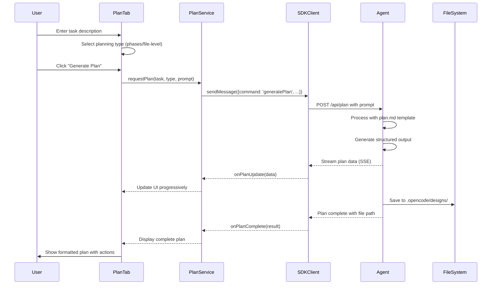

# Plan Integration Design for VSCode Webview Workflow Tab

**IMPORTANT**: This is a design document for implementing a comprehensive planning system in the vscode-webview workflow tab. The actual implementation should follow this plan verbatim. Trust the files and references provided. When implementing, do not re-verify what's written in this plan.

## Observations

Based on my exploration of the SuperCode codebase, I found:

- **Existing Vue.js Architecture**: The vscode-webview uses Vue 3 with TypeScript, featuring a WorkflowInterface component that manages tabs (PlanTab, ImplementTab, ReviewTab).
- **SuperCode SDK Integration**: There's already a WebSocket/SSE-based SDK client (SuperCodeSDKClient, SuperCodeWebSocketClient) handling communication between the webview and the backend at packages/vscode-webview/src/services/.
- **Agent System Infrastructure**: The backend has a sophisticated agent system in packages/opencode/src/agent/agent.ts with plan/build modes already implemented.
- **Current Plan Tab**: The existing PlanTab.vue at packages/vscode-webview/src/components/tabs/PlanTab.vue has a basic UI structure but lacks the detailed plan generation and rendering capabilities shown in the screenshots.
- **Prompt Templates**: The plan.md template at prompts/plan.md provides a comprehensive structure for generating implementation designs with observations, approach, reasoning, and file-level changes.
- **Message Handling**: The system uses a typed message interface defined in packages/vscode-webview/src/types/index.ts for communication between components.

## Approach

To implement the plan integration feature, I will:

1. **Extend the type system** to support plan-specific data structures including observations, approach, reasoning, mermaid diagrams, and file changes
2. **Create a planning service** that uses the plan.md prompt template to generate comprehensive implementation designs through the agent
3. **Enhance the PlanTab component** to display generated plans with collapsible sections, syntax highlighting, and proper formatting as shown in the screenshots
4. **Implement plan persistence** by saving generated plans to .opencode/designs/ with unique identifiers
5. **Add agent communication** endpoints for plan generation, including streaming support for real-time updates
6. **Create UI components** for rendering mermaid diagrams, file changes, and collapsible sections with proper dark theme styling
7. **Implement state management** to handle plan data, generation status, and user interactions

## Reasoning

This approach was chosen because:
- **Leverages Existing Infrastructure**: Uses the established SDK client, message handling, and Vue component architecture rather than creating new communication channels
- **Maintains Separation of Concerns**: Keeps plan generation logic in services, UI in components, and data structures in types
- **Follows SuperCode Patterns**: Aligns with the existing agent system, message passing, and file organization conventions
- **Progressive Enhancement**: Builds upon the current PlanTab rather than replacing it, ensuring backward compatibility
- **User Experience Focus**: Prioritizes clear visualization of complex plans with collapsible sections for better navigation
- **Scalability**: Supports future enhancements like plan versioning, collaborative editing, and execution tracking

## Architecture Diagram



## Proposed File Changes

### packages/vscode-webview/src/types/plan.ts (NEW)

<file_change_description>
**Purpose**: Define TypeScript interfaces for plan-related data structures
**Dependencies**: None
**Dependents**: PlanTab.vue, PlanService.ts, plan-components

**Specific Changes:**
- Create `PlanData` interface with fields: id, title, description, timestamp, status, type
- Add `PlanSection` interface for observations, approach, reasoning sections
- Define `FileChange` interface with: path, action (NEW/MODIFY/DELETE), description, changes array
- Create `MermaidDiagram` interface with: type, code, title
- Add `PlanGenerationRequest` interface for API calls
- Define `PlanGenerationResponse` interface for responses
- Create enum `PlanningType` with values: 'phases', 'file-level'
- Add `PlanStatus` enum: 'generating', 'ready', 'error', 'executing'

**Code Structure:**
```typescript
export interface PlanData {
  id: string
  title: string
  userQuery: string
  timestamp: number
  status: PlanStatus
  type: PlanningType
  filePath?: string
  sections: {
    observations?: PlanSection
    approach?: PlanSection
    reasoning?: PlanSection
    diagram?: MermaidDiagram
    fileChanges?: FileChange[]
  }
}

export interface PlanSection {
  title: string
  content: string
  collapsed?: boolean
}

export interface FileChange {
  path: string
  action: 'NEW' | 'MODIFY' | 'DELETE'
  description: string
  changes: ChangeDetail[]
}
```

**Integration Points:**
- Used by PlanTab.vue for rendering
- Consumed by PlanService for API calls
- Referenced in SDK client messages

**Error Handling:**
- Validate plan data structure on receipt
- Handle missing sections gracefully
- Provide fallback for malformed responses
</file_change_description>

### packages/vscode-webview/src/services/PlanService.ts (NEW)

<file_change_description>
**Purpose**: Service layer for plan generation and management
**Dependencies**: SuperCodeSDKClient, plan.md template, types/plan.ts
**Dependents**: PlanTab.vue, WorkflowInterface.vue

**Specific Changes:**
- Import SDK client and plan types
- Create `generatePlan` method accepting task description and planning type
- Implement `loadPromptTemplate` to read plan.md and inject variables
- Add `streamPlanGeneration` for real-time updates via SSE
- Create `savePlanToFile` method to persist plans to .opencode/designs/
- Implement `loadSavedPlans` to retrieve existing plans
- Add `formatPlanForDisplay` to prepare data for UI rendering
- Create event emitters for plan updates

**Code Structure:**
```typescript
import { SuperCodeSDKClient } from './SuperCodeSDKClient'
import type { PlanData, PlanGenerationRequest } from '../types/plan'

export class PlanService {
  private client: SuperCodeSDKClient

  async generatePlan(request: PlanGenerationRequest): Promise<PlanData> {
    const prompt = await this.loadPromptTemplate(request)
    const response = await this.client.sendMessage({
      command: 'generatePlan',
      prompt,
      type: request.type
    })
    return this.formatPlanData(response)
  }

  private async loadPromptTemplate(request: PlanGenerationRequest): Promise<string> {
    // Load prompts/plan.md and replace $ARGUMENTS
  }
}
```

**Integration Points:**
- Connects to backend agent via SDK client
- Saves plans to filesystem via agent tools
- Emits events for UI updates

**Error Handling:**
- Retry logic for network failures
- Validation of agent responses
- User-friendly error messages
</file_change_description>

### packages/vscode-webview/src/prompts/plan.md (NEW)

<file_change_description>
**Purpose**: Localized copy of the plan.md template for the webview
**Dependencies**: None
**Dependents**: PlanService.ts

**Specific Changes:**
- Copy the existing prompts/plan.md template
- Place in packages/vscode-webview/src/prompts/ for local access
- Ensure proper variable substitution markers ($ARGUMENTS)
- Add section markers for parsing structured output
- Include instructions for generating parseable JSON alongside markdown

**Code Structure:**
The existing plan.md template structure with clear section delimiters for parsing

**Integration Points:**
- Loaded by PlanService.ts
- Variables replaced at runtime
- Sent to agent for processing

**Error Handling:**
- File existence check
- Template validation
- Fallback to default template
</file_change_description>

### packages/vscode-webview/src/components/tabs/PlanTab.vue (MODIFY)

<file_change_description>
**Purpose**: Enhanced UI for displaying and interacting with generated plans
**Dependencies**: PlanService.ts, plan UI components, types/plan.ts
**Dependents**: WorkflowInterface.vue

**Specific Changes:**
- Import PlanService and new plan types
- Replace mock data with actual plan generation calls
- Add collapsible sections for observations, approach, reasoning
- Implement mermaid diagram rendering component
- Create file change cards with syntax highlighting
- Add plan saving and loading functionality
- Implement copy/edit actions for sections
- Add loading states and error handling
- Apply dark theme styling matching screenshots

**Code Structure:**
```vue
<template>
  <div class="plan-tab">
    <!-- User Query Section -->
    <section class="user-query-section" v-if="planData">
      <div class="section-header">
        <h3>User Query</h3>
        <div class="section-actions">
          <button @click="copyQuery">Copy Query</button>
          <button @click="editQuery">Edit Query</button>
        </div>
      </div>
      <div class="query-content">{{ planData.userQuery }}</div>
    </section>

    <!-- Plan Specification Section -->
    <section class="plan-specification">
      <CollapsibleSection
        title="Observations"
        :content="planData.sections.observations"
        :collapsed="false"
      />
      <CollapsibleSection
        title="Approach"
        :content="planData.sections.approach"
      />
      <CollapsibleSection
        title="Reasoning"
        :content="planData.sections.reasoning"
        :collapsed="true"
      />
      <MermaidDiagram
        v-if="planData.sections.diagram"
        :diagram="planData.sections.diagram"
      />
    </section>

    <!-- File Changes Section -->
    <FileChangesList
      :changes="planData.sections.fileChanges"
      @add-file="handleAddFile"
    />
  </div>
</template>
```

**Integration Points:**
- Receives task data from WorkflowInterface
- Calls PlanService for generation
- Emits events for plan execution

**Error Handling:**
- Loading states during generation
- Error messages for failed generations
- Retry mechanisms
</file_change_description>

### packages/vscode-webview/src/components/plan/CollapsibleSection.vue (NEW)

<file_change_description>
**Purpose**: Reusable component for collapsible content sections
**Dependencies**: Vue 3
**Dependents**: PlanTab.vue

**Specific Changes:**
- Create props for title, content, collapsed state
- Implement expand/collapse animation
- Add chevron icon rotation on toggle
- Style with dark theme and hover effects
- Handle markdown content rendering
- Add copy button for section content

**Code Structure:**
```vue
<template>
  <div class="collapsible-section">
    <div class="section-header" @click="toggle">
      <ChevronIcon :class="{ rotated: !isCollapsed }" />
      <h3>{{ title }}</h3>
    </div>
    <transition name="collapse">
      <div v-show="!isCollapsed" class="section-content">
        <div v-html="renderedContent"></div>
      </div>
    </transition>
  </div>
</template>

<script setup>
import { ref, computed } from 'vue'
import { marked } from 'marked'

const props = defineProps<{
  title: string
  content: string
  collapsed?: boolean
}>()

const isCollapsed = ref(props.collapsed ?? false)
const renderedContent = computed(() => marked.parse(props.content))
</script>
```

**Integration Points:**
- Used in PlanTab for each section
- Receives markdown content
- Emits toggle events

**Error Handling:**
- Safe markdown rendering
- Handle missing content
- Graceful animation failures
</file_change_description>

### packages/vscode-webview/src/components/plan/MermaidDiagram.vue (NEW)

<file_change_description>
**Purpose**: Component for rendering mermaid diagrams
**Dependencies**: mermaid library, Vue 3
**Dependents**: PlanTab.vue

**Specific Changes:**
- Install mermaid as dependency
- Create component accepting diagram code
- Implement mermaid initialization with dark theme
- Add expand/fullscreen viewing option
- Include copy diagram code button
- Handle diagram rendering errors gracefully
- Style container with proper spacing

**Code Structure:**
```vue
<template>
  <div class="mermaid-diagram">
    <div class="diagram-header">
      <h3>Mermaid Diagram</h3>
      <div class="diagram-actions">
        <button @click="copyCode">Copy</button>
        <button @click="toggleFullscreen">Expand</button>
      </div>
    </div>
    <div ref="mermaidContainer" class="diagram-content">
      <div class="mermaid" v-html="diagram.code"></div>
    </div>
  </div>
</template>

<script setup>
import { onMounted, ref } from 'vue'
import mermaid from 'mermaid'

mermaid.initialize({
  theme: 'dark',
  themeVariables: {
    primaryColor: '#0066ff',
    primaryTextColor: '#e0e0e0',
    primaryBorderColor: '#333'
  }
})
</script>
```

**Integration Points:**
- Receives diagram data from PlanTab
- Renders using mermaid library
- Handles user interactions

**Error Handling:**
- Fallback for invalid diagram syntax
- Error message display
- Retry rendering mechanism
</file_change_description>

### packages/vscode-webview/src/components/plan/FileChangeCard.vue (NEW)

<file_change_description>
**Purpose**: Component for displaying individual file changes
**Dependencies**: Vue 3, syntax highlighting library
**Dependents**: FileChangesList.vue, PlanTab.vue

**Specific Changes:**
- Create expandable card for each file change
- Display file path with action badge (NEW/MODIFY/DELETE)
- Show description and specific changes
- Add syntax highlighting for code snippets
- Include "Add file or resource" button
- Style with hover effects and proper spacing
- Implement expand/collapse for detailed changes

**Code Structure:**
```vue
<template>
  <div class="file-change-card" :class="{ expanded: isExpanded }">
    <div class="card-header" @click="toggleExpand">
      <div class="file-info">
        <FileIcon :type="fileType" />
        <span class="file-path">{{ change.path }}</span>
        <ActionBadge :action="change.action" />
      </div>
      <ChevronIcon :class="{ rotated: isExpanded }" />
    </div>
    <transition name="expand">
      <div v-if="isExpanded" class="card-content">
        <p class="change-description">{{ change.description }}</p>
        <div class="change-details">
          <ul>
            <li v-for="detail in change.changes" :key="detail.id">
              {{ detail }}
            </li>
          </ul>
        </div>
        <button class="add-resource-btn">
          Add file or resource
        </button>
      </div>
    </transition>
  </div>
</template>
```

**Integration Points:**
- Receives file change data
- Emits add file events
- Handles user interactions

**Error Handling:**
- Handle missing file information
- Validate action types
- Graceful rendering failures
</file_change_description>

### packages/vscode-webview/package.json (MODIFY)

<file_change_description>
**Purpose**: Add required dependencies for plan integration
**Dependencies**: None
**Dependents**: Build system

**Specific Changes:**
- Add "mermaid": "^10.6.0" for diagram rendering
- Add "marked": "^11.0.0" for markdown parsing
- Add "prismjs": "^1.29.0" for syntax highlighting
- Update build scripts if needed

**Code Structure:**
```json
{
  "dependencies": {
    "mermaid": "^10.6.0",
    "marked": "^11.0.0",
    "prismjs": "^1.29.0"
  }
}
```

**Integration Points:**
- Used by new components
- Required for plan rendering

**Error Handling:**
- Version compatibility checks
- Fallback for missing libraries
</file_change_description>

### packages/opencode/src/server/endpoints/plan.ts (NEW)

<file_change_description>
**Purpose**: Backend endpoint for plan generation
**Dependencies**: Agent system, file system tools
**Dependents**: SDK client calls

**Specific Changes:**
- Create POST /api/plan endpoint
- Accept plan generation requests with prompt
- Integrate with agent.ts for processing
- Stream responses via SSE
- Save generated plans to .opencode/designs/
- Return file path and plan data
- Handle concurrent plan generations

**Code Structure:**
```typescript
import { Agent } from '../../agent/agent'

export async function handlePlanGeneration(req: Request): Promise<Response> {
  const { prompt, type, taskId } = await req.json()

  const agent = new Agent({ mode: 'plan' })
  const planId = `plan-${Date.now()}`

  // Process with agent
  const result = await agent.process(prompt)

  // Save to filesystem
  const filePath = `.opencode/designs/${planId}.md`
  await saveFile(filePath, result)

  return new Response(JSON.stringify({
    success: true,
    planId,
    filePath,
    data: parsePlanOutput(result)
  }))
}
```

**Integration Points:**
- Called by SDK client
- Uses agent for processing
- Saves via file system tools

**Error Handling:**
- Request validation
- Agent error handling
- File system error recovery
</file_change_description>

### packages/vscode-webview/src/styles/plan.css (NEW)

<file_change_description>
**Purpose**: Styles specific to plan components
**Dependencies**: CSS variables from main theme
**Dependents**: Plan components

**Specific Changes:**
- Define styles for collapsible sections
- Add file change card styles
- Create mermaid diagram container styles
- Style action buttons and badges
- Add transition animations
- Implement dark theme with proper contrast
- Match screenshot design aesthetics

**Code Structure:**
```css
.plan-tab {
  --section-bg: rgba(255, 255, 255, 0.02);
  --section-border: rgba(255, 255, 255, 0.05);
  --accent-color: #0066ff;
}

.collapsible-section {
  background: var(--section-bg);
  border: 1px solid var(--section-border);
  border-radius: 8px;
  margin-bottom: 16px;
  transition: all 0.2s ease;
}

.file-change-card {
  background: var(--section-bg);
  border: 1px solid var(--section-border);
  border-radius: 8px;
  margin-bottom: 12px;
}

.action-badge {
  padding: 2px 8px;
  border-radius: 4px;
  font-size: 11px;
  font-weight: 600;
  text-transform: uppercase;
}

.action-badge.new {
  background: rgba(0, 255, 127, 0.15);
  color: #00ff7f;
}

.action-badge.modify {
  background: rgba(0, 102, 255, 0.15);
  color: #0066ff;
}
```

**Integration Points:**
- Imported in components
- Uses theme variables
- Consistent with existing styles

**Error Handling:**
- Fallback colors
- Browser compatibility
- Responsive design
</file_change_description>

## Implementation Strategy

1. **Phase 1: Type System and Data Structures**
   - Create types/plan.ts with all interfaces
   - Update existing types/index.ts with plan message types

2. **Phase 2: Backend Integration**
   - Create plan generation endpoint
   - Integrate with existing agent system
   - Set up file saving to .opencode/designs/

3. **Phase 3: Service Layer**
   - Implement PlanService.ts
   - Set up SDK client communication
   - Add SSE streaming support

4. **Phase 4: UI Components**
   - Create reusable plan components
   - Enhance PlanTab.vue
   - Add styling and animations

5. **Phase 5: Testing and Polish**
   - Test plan generation flow
   - Verify file saving
   - Polish UI interactions

## Success Criteria

- Plans are generated using the plan.md template with proper structure
- Generated plans are saved to .opencode/designs/ with unique identifiers
- UI displays plans with collapsible sections matching the screenshots
- Mermaid diagrams render correctly with dark theme
- File changes are clearly displayed with action badges
- User can copy sections and edit queries
- System handles errors gracefully with user-friendly messages

## File Save Location

Generated plans will be saved to: **`.opencode/designs/[timestamp]-[task-summary].md`**

Example: `.opencode/designs/2024-09-17-workflow-plan-integration.md`

This location will be displayed to the user in the UI after successful plan generation.