# OpenCode Architecture and Call Flow Diagrams

## Executive Summary

This document provides comprehensive architecture and call flow diagrams for the OpenCode system, illustrating the complete journey from user prompt to AI response, including message streaming, tool execution, agent selection, and model interaction patterns. These diagrams serve as a visual guide for understanding system complexity and implementing HTML versions with full functional parity.

## Table of Contents

1. [System Architecture Overview](#system-architecture-overview)
2. [End-to-End Message Flow](#end-to-end-message-flow)
3. [Tool Execution Architecture](#tool-execution-architecture)
4. [Real-time Communication Patterns](#real-time-communication-patterns)
5. [Component Interaction Diagrams](#component-interaction-diagrams)
6. [State Management Flow](#state-management-flow)
7. [HTML Implementation Architecture](#html-implementation-architecture)

---

## System Architecture Overview

### High-Level System Components

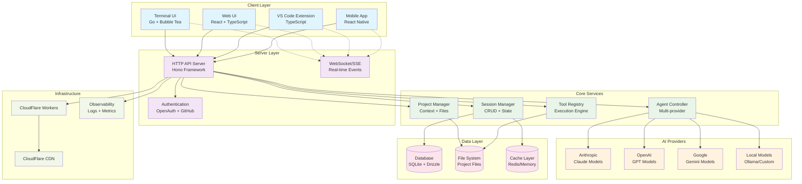

### Core System Layers

**1. Client Layer**
- **Terminal UI**: Go-based TUI using Bubble Tea framework
- **Web UI**: React + TypeScript with real-time capabilities
- **VS Code Extension**: TypeScript integration with IDE
- **Mobile Apps**: React Native for cross-platform support

**2. Server Layer**
- **HTTP API**: Hono-based REST API with OpenAPI specification
- **Real-time Events**: Server-Sent Events for live updates
- **Authentication**: OpenAuth with GitHub Copilot integration

**3. Core Services**
- **Session Manager**: CRUD operations and conversation state
- **Agent Controller**: Multi-provider AI model management
- **Tool Registry**: Tool execution and response handling
- **Project Manager**: File system context and project awareness

**4. AI Provider Layer**
- **Anthropic Claude**: Primary AI provider with tool support
- **OpenAI GPT**: Alternative provider with parameter transformation
- **Google Gemini**: Provider with schema sanitization
- **Local Models**: Ollama and custom model support

**5. Data Layer**
- **Database**: SQLite with Drizzle ORM for structured data
- **File System**: Direct file access for project operations
- **Cache Layer**: Redis/Memory for performance optimization

---

## End-to-End Message Flow

### Complete User Interaction Flow

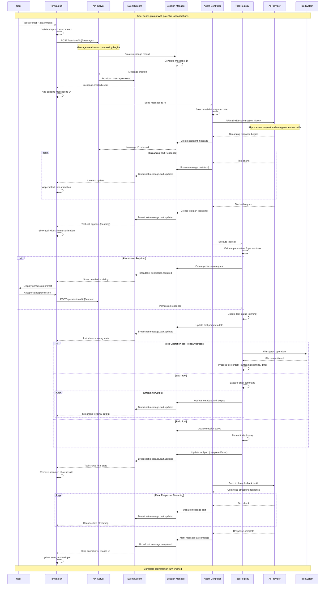

### Message State Transitions

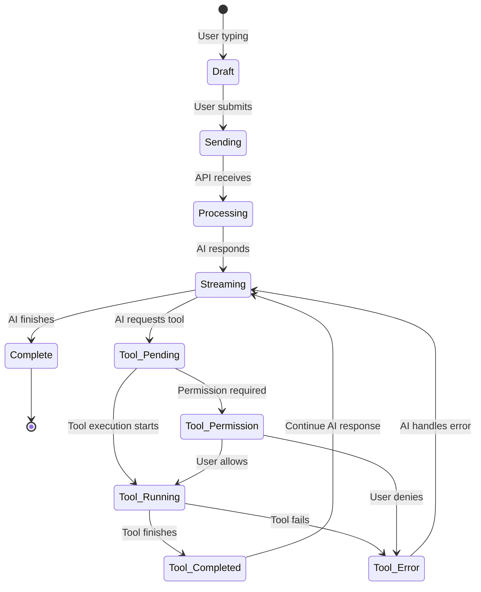

---

## Tool Execution Architecture

### Tool Registry and Execution Engine

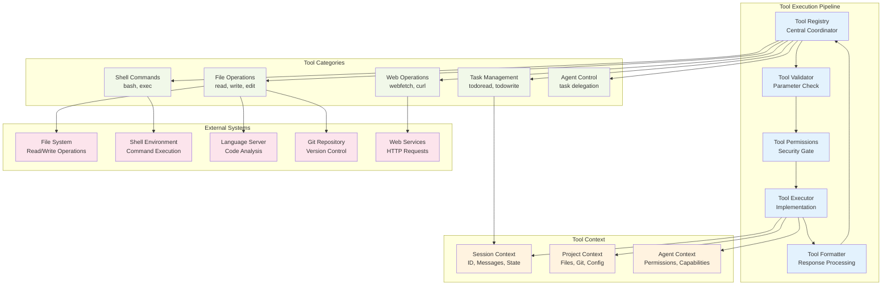

### Tool Execution Call Flow

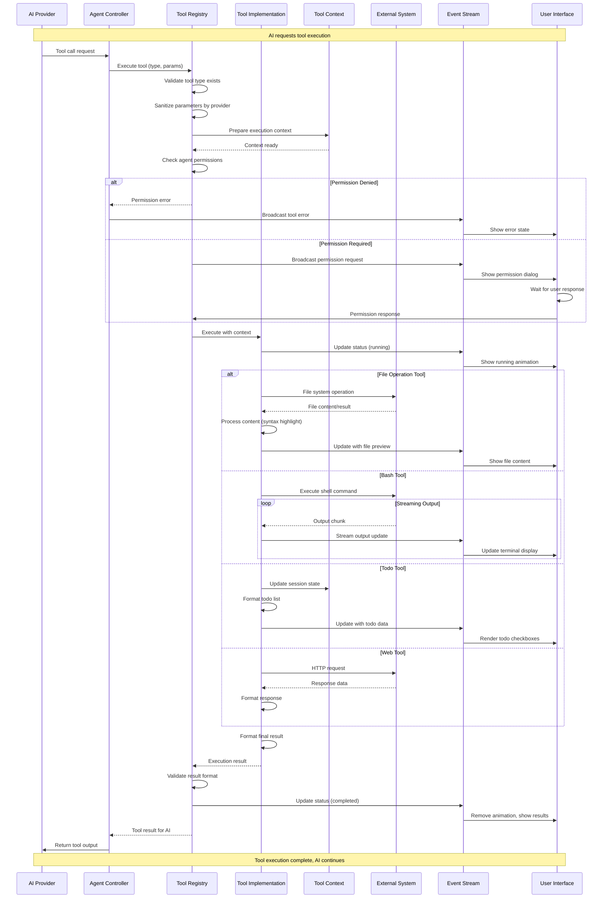

---

## Real-time Communication Patterns

### Server-Sent Events Architecture

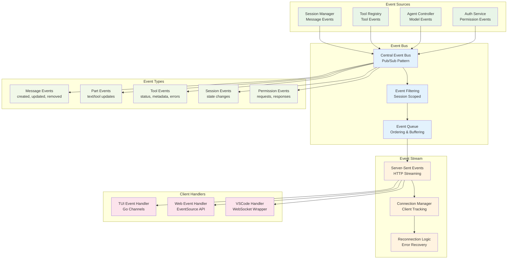

### Event Flow Patterns

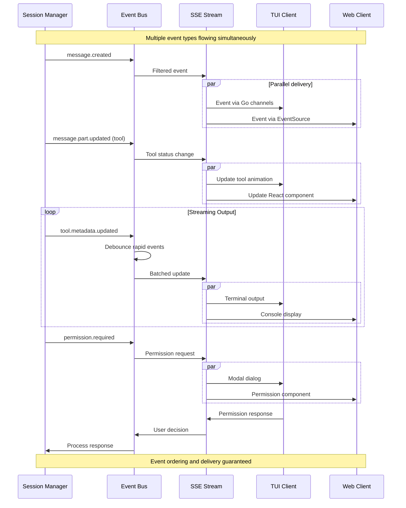

---

## Component Interaction Diagrams

### TUI Component Architecture

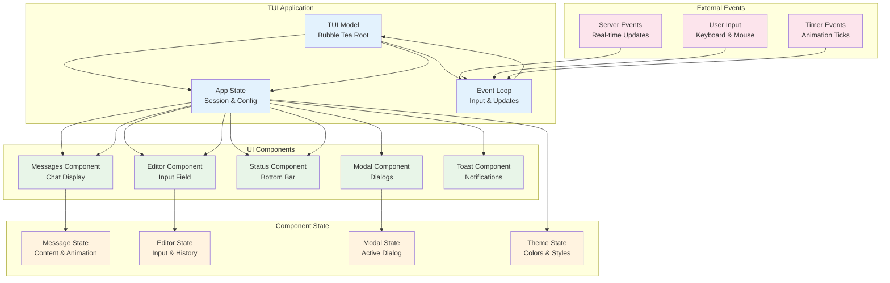

### Message Rendering Pipeline

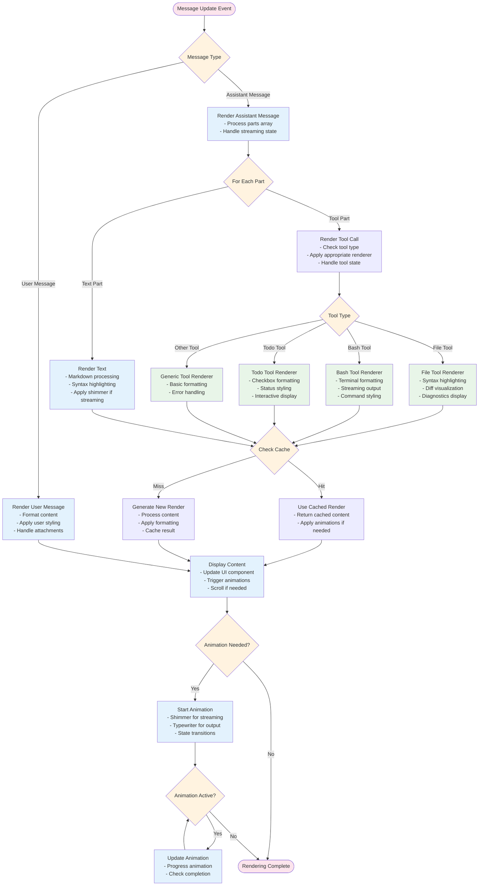

---

## State Management Flow

### Application State Architecture

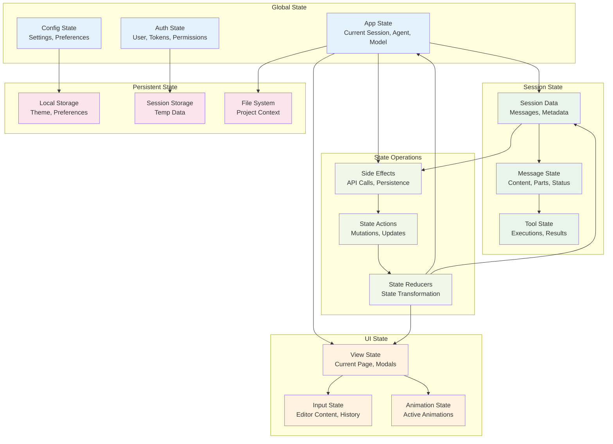

### State Update Flow

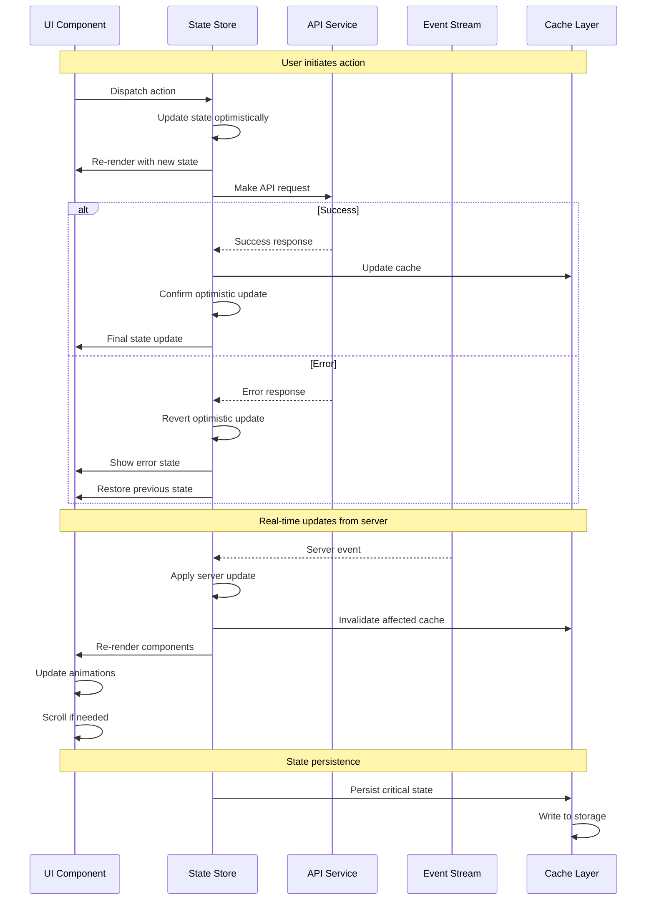

---

## HTML Implementation Architecture

### Web Application Architecture

```mermaid
graph TB
    subgraph "Frontend Framework"
        React[React 18<br/>Component Framework]
        TS[TypeScript<br/>Type Safety]
        Vite[Vite<br/>Build Tool]
    end

    subgraph "State Management"
        Zustand[Zustand Store<br/>Global State]
        ReactQuery[React Query<br/>Server State]
        LocalState[React State<br/>Component State]
    end

    subgraph "Communication Layer"
        EventSource[EventSource API<br/>Server-Sent Events]
        FetchAPI[Fetch API<br/>HTTP Requests]
        WebSocket[WebSocket<br/>Bi-directional Comms]
    end

    subgraph "UI Components"
        ChatComponents[Chat Components<br/>Messages, Editor, Tools]
        ModalComponents[Modal Components<br/>Dialogs, Settings]
        CommonComponents[Common Components<br/>Layout, Theme, Utils]
    end

    subgraph "Tool System"
        ToolRenderers[Tool Renderers<br/>File, Bash, Todo]
        ToolStore[Tool Store<br/>State Management]
        ToolEvents[Tool Events<br/>Real-time Updates]
    end

    subgraph "Performance Layer"
        VirtualScroll[Virtual Scrolling<br/>Large Lists]
        Memoization[React.memo<br/>Component Caching]
        CodeSplitting[Code Splitting<br/>Lazy Loading]
    end

    subgraph "Styling System"
        TailwindCSS[Tailwind CSS<br/>Utility Framework]
        ThemeProvider[Theme Provider<br/>Dynamic Theming]
        Animations[Framer Motion<br/>Animations]
    end

    %% Framework connections
    React --> TS
    React --> Vite
    
    %% State management
    React --> Zustand
    React --> ReactQuery
    React --> LocalState
    
    %% Communication
    ReactQuery --> FetchAPI
    Zustand --> EventSource
    EventSource --> WebSocket
    
    %% UI system
    React --> ChatComponents
    React --> ModalComponents
    React --> CommonComponents
    
    %% Tool integration
    ChatComponents --> ToolRenderers
    ToolRenderers --> ToolStore
    ToolStore --> ToolEvents
    ToolEvents --> EventSource
    
    %% Performance
    ChatComponents --> VirtualScroll
    React --> Memoization
    Vite --> CodeSplitting
    
    %% Styling
    React --> TailwindCSS
    TailwindCSS --> ThemeProvider
    React --> Animations

    classDef framework fill:#e3f2fd
    classDef state fill:#e8f5e8
    classDef comm fill:#fff3e0
    classDef ui fill:#f1f8e9
    classDef tools fill:#fce4ec
    classDef perf fill:#f3e5f5
    classDef style fill:#e0f2f1

    class React,TS,Vite framework
    class Zustand,ReactQuery,LocalState state
    class EventSource,FetchAPI,WebSocket comm
    class ChatComponents,ModalComponents,CommonComponents ui
    class ToolRenderers,ToolStore,ToolEvents tools
    class VirtualScroll,Memoization,CodeSplitting perf
    class TailwindCSS,ThemeProvider,Animations style
```

### React Component Hierarchy

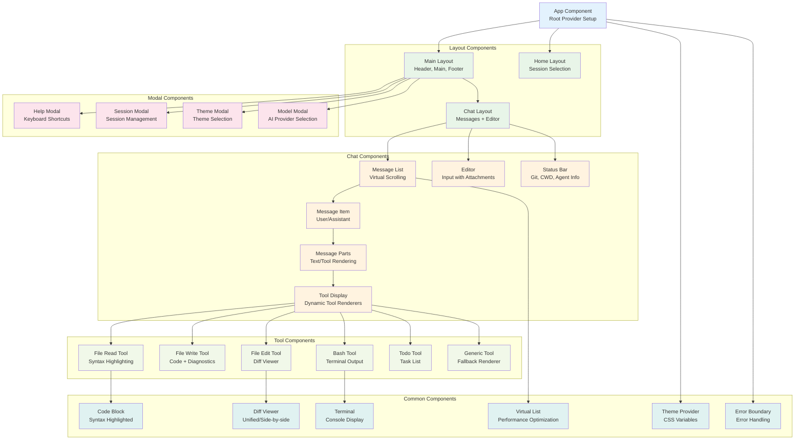

---

## Implementation Considerations

### Performance Optimization Strategies

1. **Virtual Scrolling**
   - Handle large message lists efficiently
   - Render only visible items + buffer
   - Smooth scrolling with position caching

2. **Intelligent Caching**
   - Component-level memoization with React.memo
   - Tool result caching with cache invalidation
   - Theme-aware caching strategies

3. **Code Splitting**
   - Lazy load modal components
   - Dynamic import of tool renderers
   - Route-based splitting for different views

4. **Animation Performance**
   - CSS animations over JavaScript
   - GPU acceleration for shimmer effects
   - Efficient animation lifecycle management

### Real-time Communication

1. **EventSource Integration**
   - Automatic reconnection on connection loss
   - Event queuing during disconnection
   - Exponential backoff retry strategy

2. **State Synchronization**
   - Optimistic updates for better UX
   - Server reconciliation for consistency
   - Conflict resolution strategies

3. **Error Handling**
   - Graceful degradation on network issues
   - User feedback for connection problems
   - Fallback to polling if EventSource fails

### Accessibility and UX

1. **Keyboard Navigation**
   - Full keyboard accessibility
   - Focus management for modals
   - Keyboard shortcuts matching TUI

2. **Screen Reader Support**
   - ARIA labels for tool states
   - Semantic HTML structure
   - Live regions for dynamic content

3. **Responsive Design**
   - Mobile-first approach
   - Adaptive layouts for different screen sizes
   - Touch-friendly interactions

This architecture provides a comprehensive blueprint for implementing the OpenCode HTML client while maintaining functional parity with the TUI and ensuring optimal performance, accessibility, and user experience.