# OpenCode Detailed Interaction Diagrams

## Table of Contents

1. [Agent and Model Selection Flow](#agent-and-model-selection-flow)
2. [Session Management Patterns](#session-management-patterns)  
3. [Permission System Flow](#permission-system-flow)
4. [Error Handling and Recovery](#error-handling-and-recovery)
5. [Theme and Configuration Management](#theme-and-configuration-management)
6. [Performance Optimization Flows](#performance-optimization-flows)

---

## Agent and Model Selection Flow

### Agent Selection and Switching

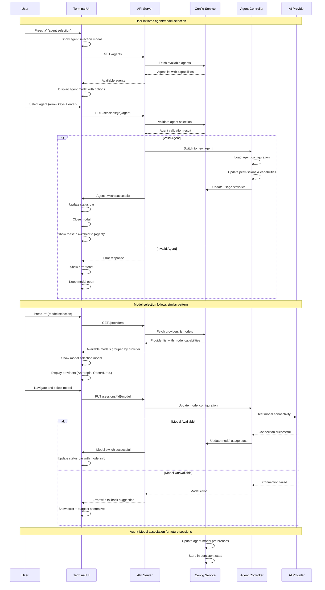

### Model Capability and Parameter Handling

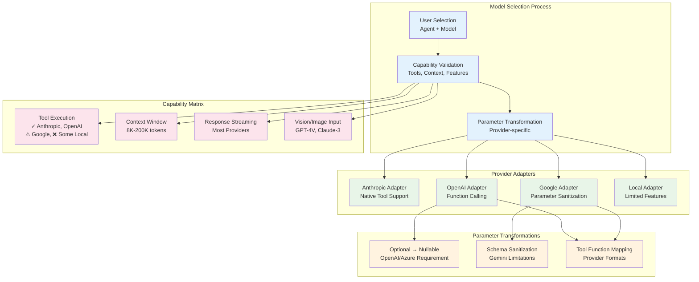

---

## Session Management Patterns

### Session Lifecycle Management

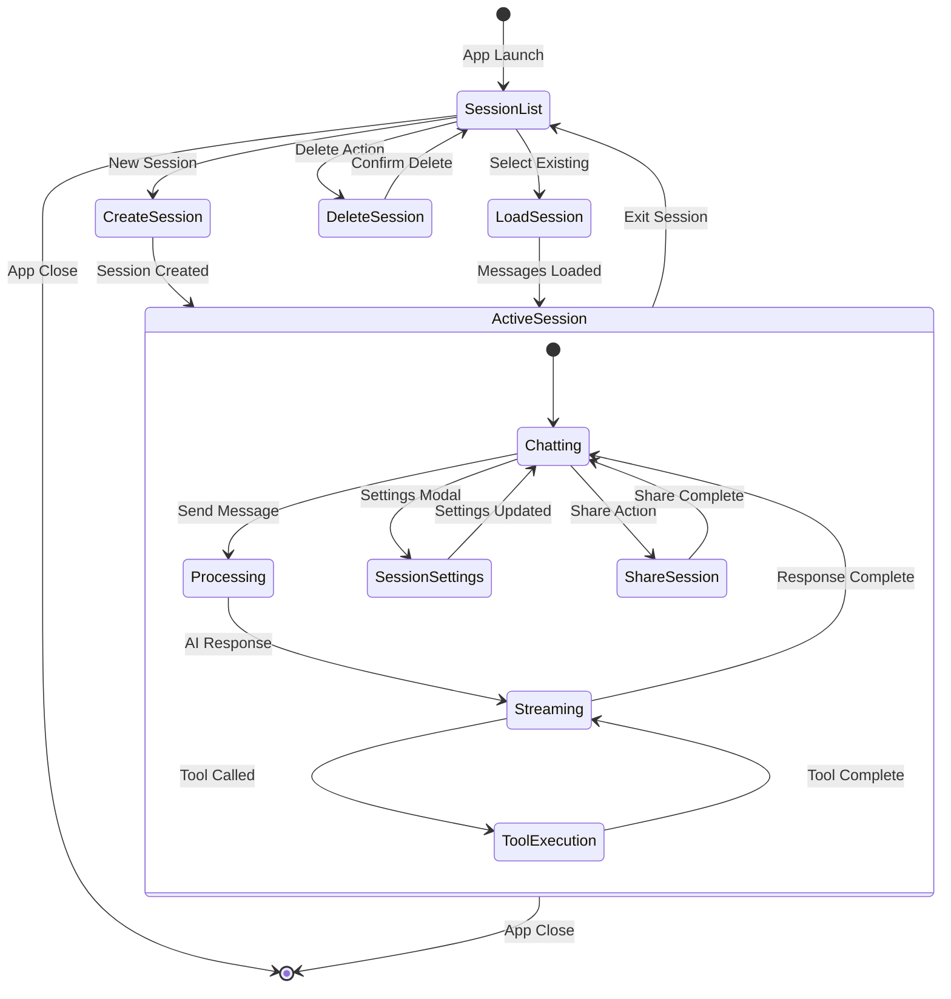

### Session Data Flow and Persistence

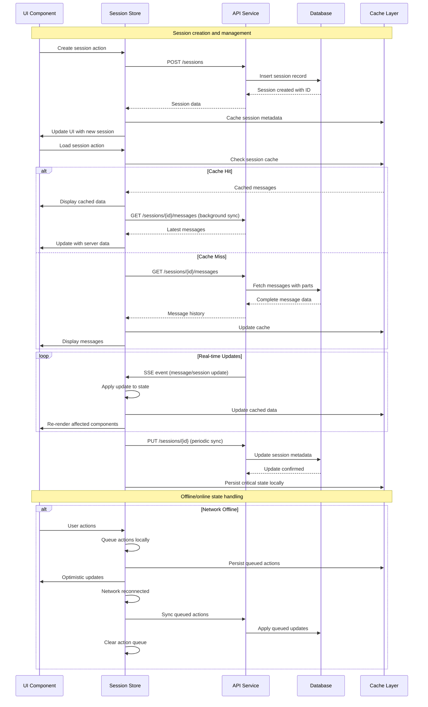

---

## Permission System Flow

### Permission Request and Approval Flow

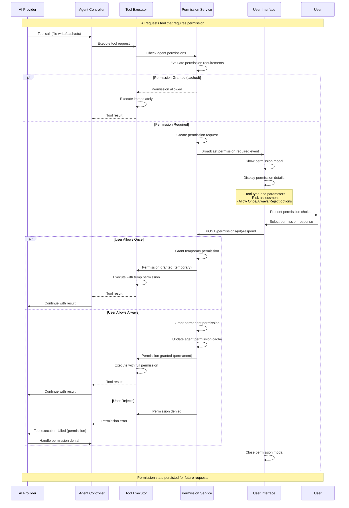

### Permission Matrix and Risk Assessment

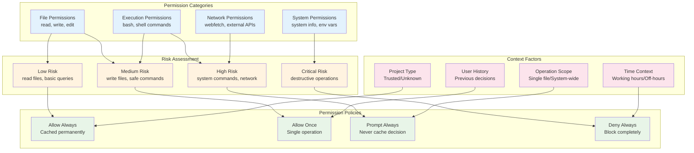

---

## Error Handling and Recovery

### Error Propagation and Recovery Flow

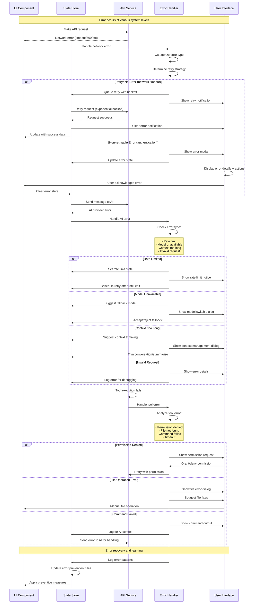

### Error Classification and Response Matrix

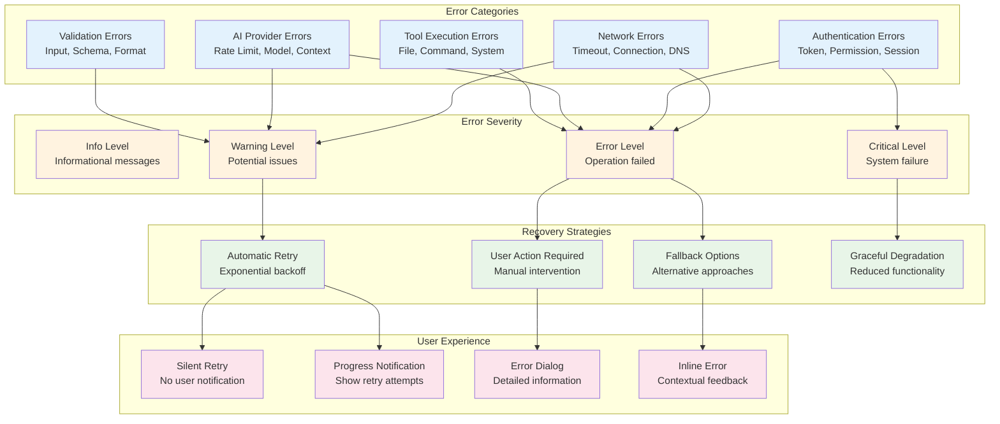

---

## Theme and Configuration Management

### Dynamic Theme Switching

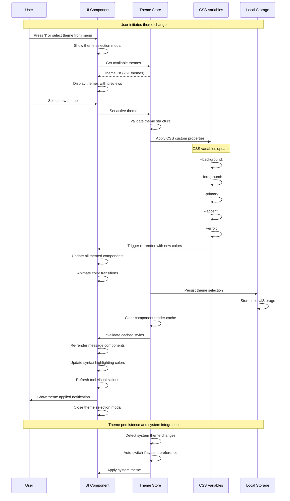

### Configuration Management Flow

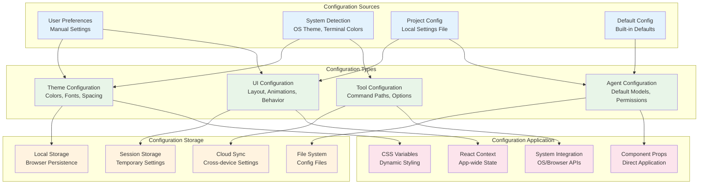

---

## Performance Optimization Flows

### Caching and Performance Strategy

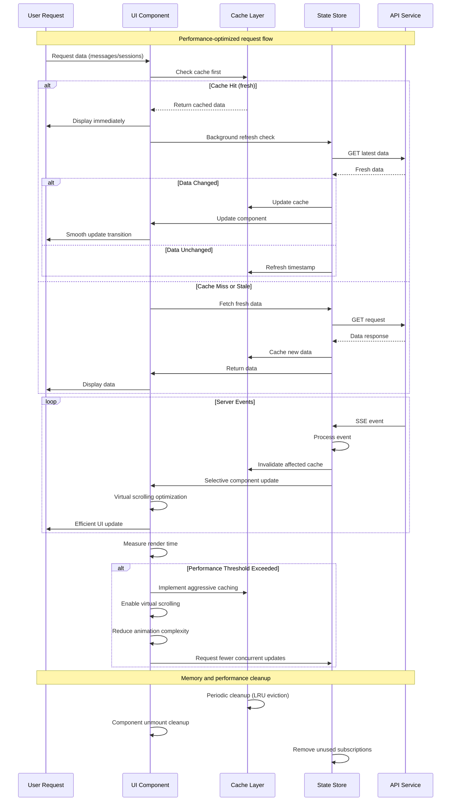

### Virtual Scrolling and Large Dataset Handling

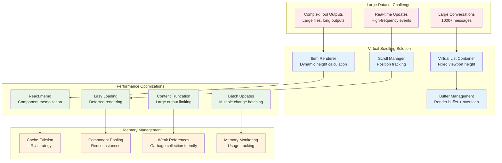

---

## Implementation Summary

These detailed interaction diagrams provide comprehensive insight into:

### 🎯 **Core System Flows**
- **Agent/Model Selection**: Dynamic switching with capability validation
- **Session Management**: Complete lifecycle with persistence and caching
- **Permission System**: Security-first approach with user control
- **Error Handling**: Comprehensive recovery and user experience patterns

### 🚀 **Performance Patterns**
- **Virtual Scrolling**: Handle large conversations efficiently  
- **Intelligent Caching**: Multi-layer caching with invalidation
- **Memory Management**: Prevent memory leaks and optimize usage
- **Real-time Optimization**: Efficient event handling and updates

### 🎨 **User Experience**
- **Theme Management**: Dynamic switching with system integration
- **Configuration**: Flexible, multi-source configuration system  
- **Error Recovery**: Graceful degradation and user guidance
- **Performance Monitoring**: Adaptive optimization based on usage

These diagrams serve as a complete blueprint for implementing the OpenCode HTML client with full functional parity, optimal performance, and excellent user experience. Each flow diagram includes specific implementation details, error handling strategies, and performance considerations essential for a production-quality implementation.