# OpenCode Tool Execution Flow Diagrams

## Table of Contents

1. [Tool Execution Pipeline Overview](#tool-execution-pipeline-overview)
2. [File Operation Tools Flow](#file-operation-tools-flow)
3. [Shell Command Execution Flow](#shell-command-execution-flow)
4. [Todo Management Tools Flow](#todo-management-tools-flow)
5. [Web Fetch Tools Flow](#web-fetch-tools-flow)
6. [Task Delegation Tools Flow](#task-delegation-tools-flow)
7. [Permission Integration Flow](#permission-integration-flow)
8. [Error Handling and Recovery](#error-handling-and-recovery)

---

## Tool Execution Pipeline Overview

### Master Tool Execution Flow

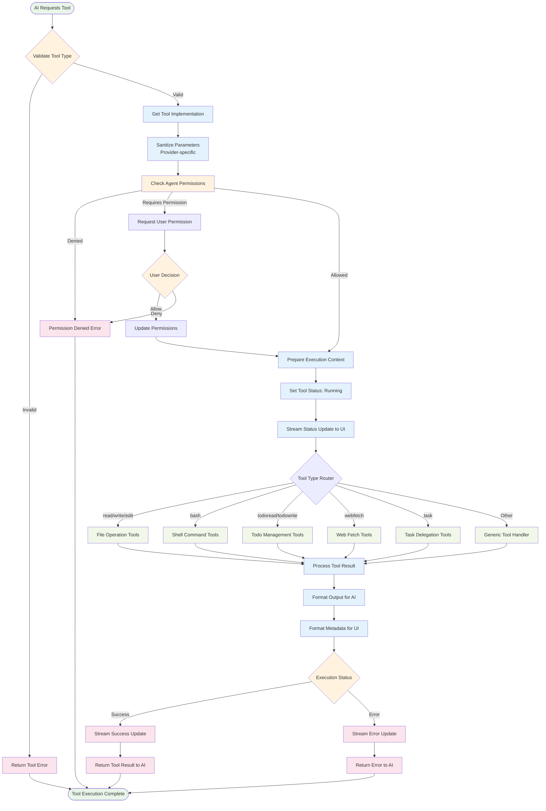

### Tool State Management Lifecycle

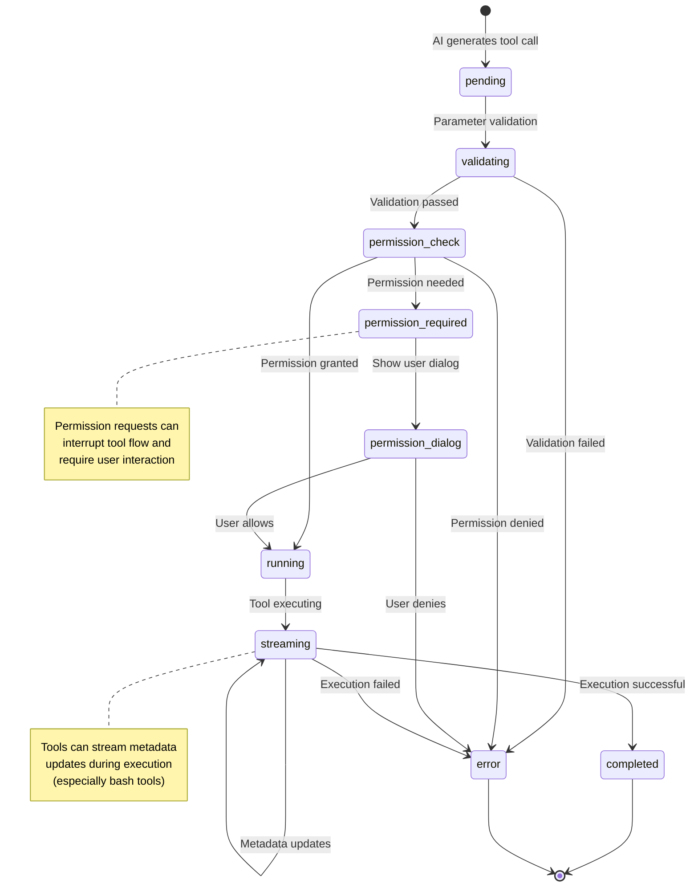

---

## File Operation Tools Flow

### File Read Tool Execution

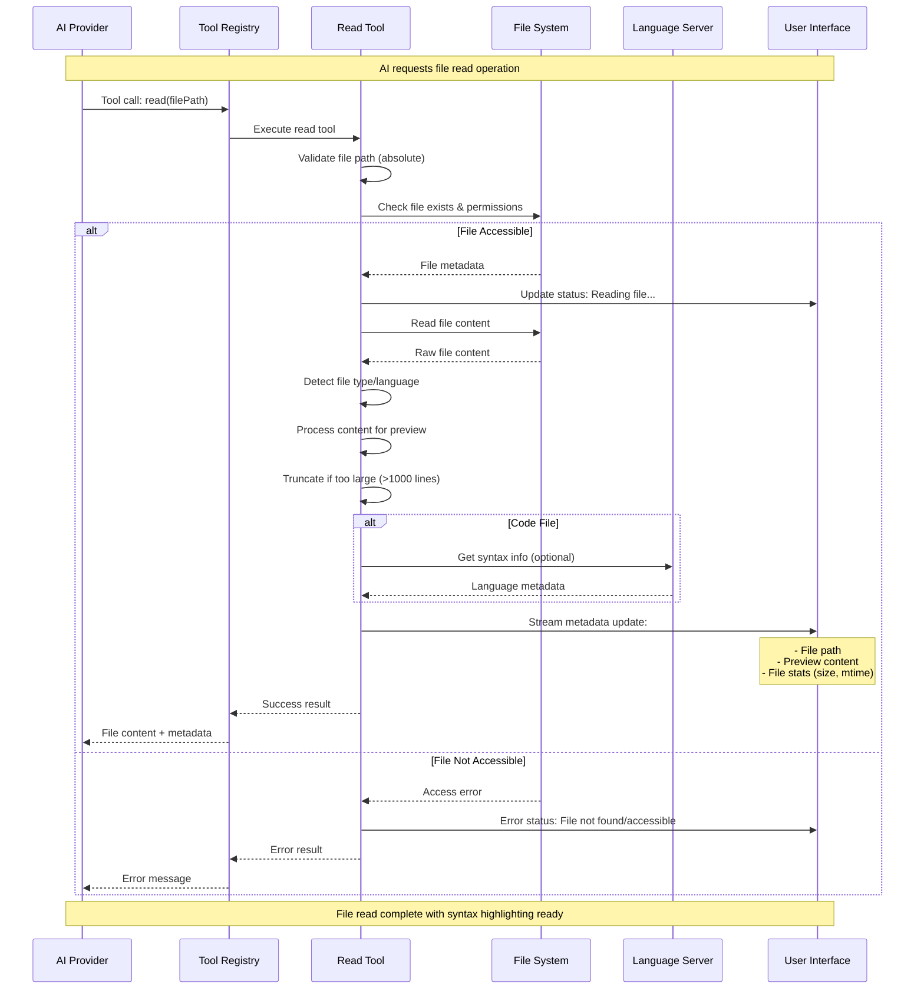

### File Write Tool Execution with LSP Integration

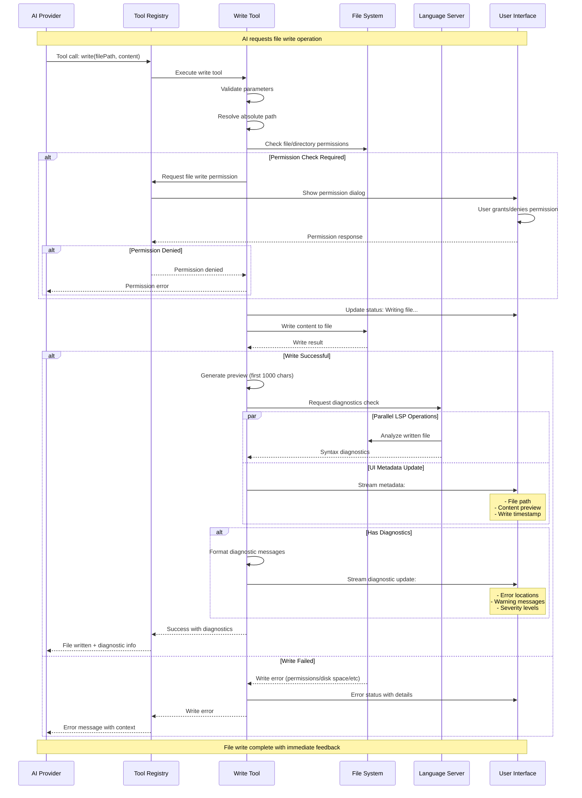

### File Edit Tool with Advanced Replacement

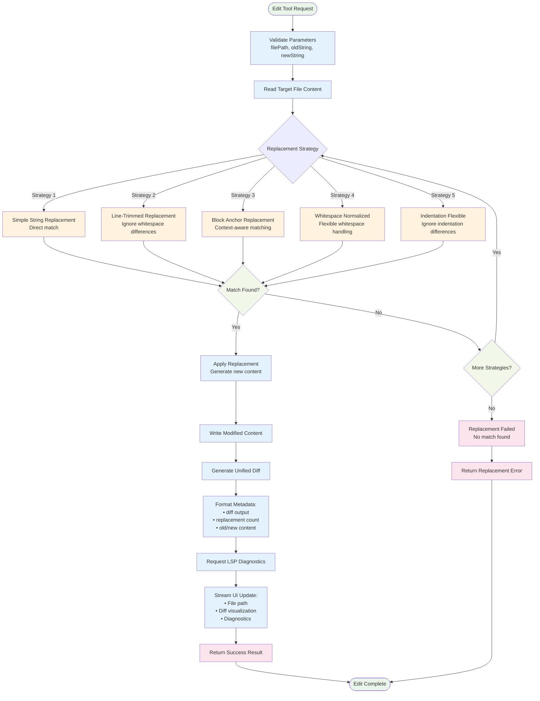

---

## Shell Command Execution Flow

### Bash Tool with Real-time Streaming

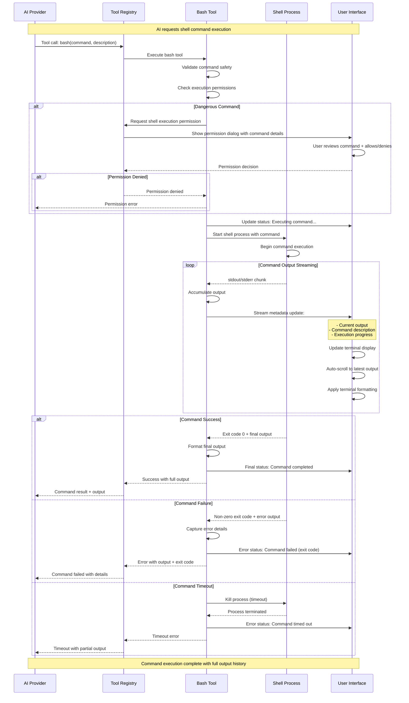

### Shell Command Security and Validation

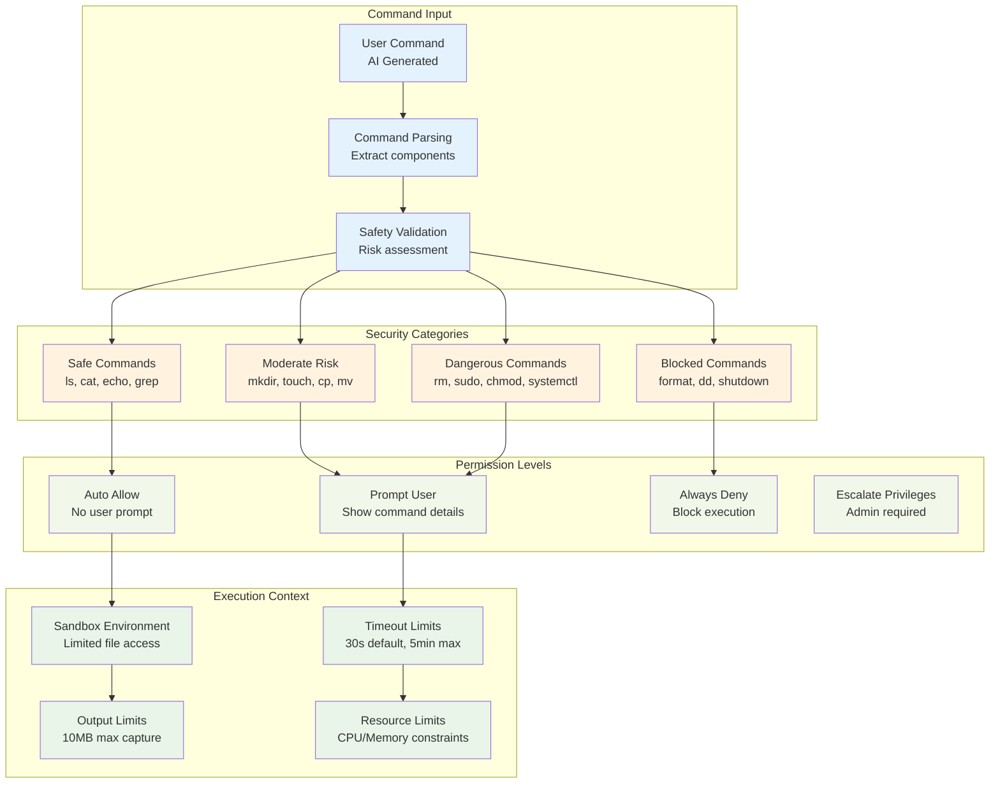

---

## Todo Management Tools Flow

### Todo Write Tool with State Management

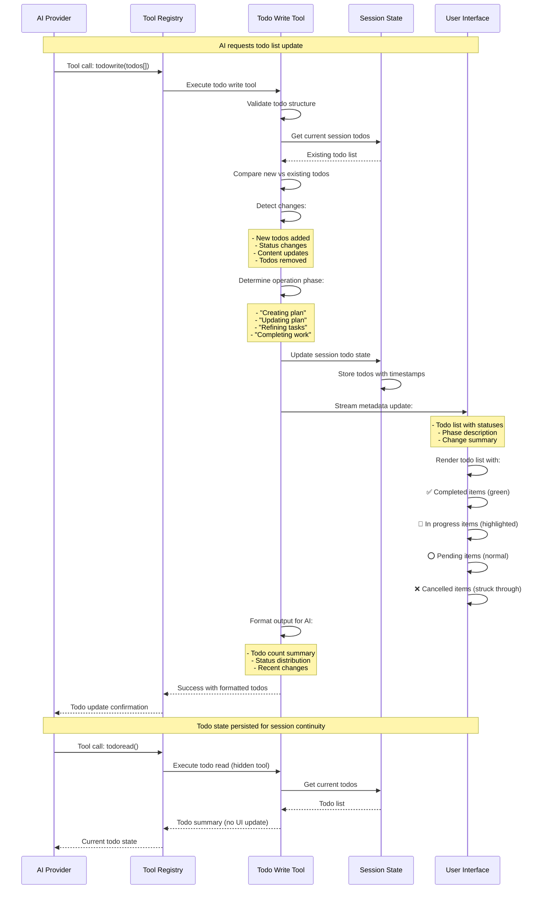

### Todo Status Flow and Lifecycle

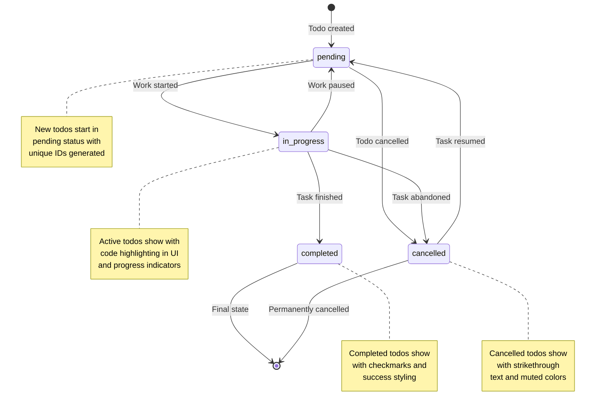

---

## Web Fetch Tools Flow

### Web Fetch Tool with Content Processing

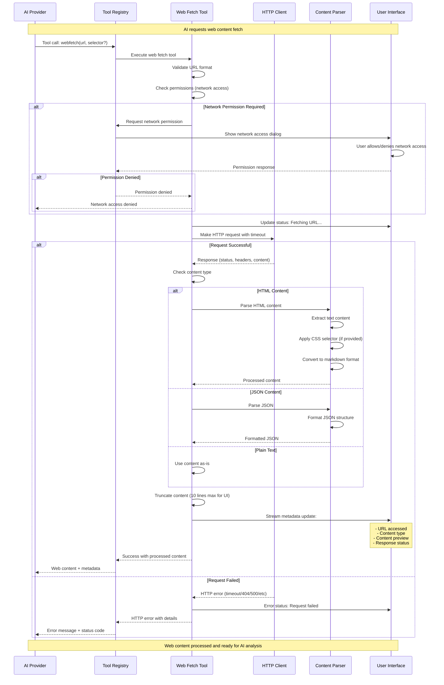

### Web Content Processing Pipeline

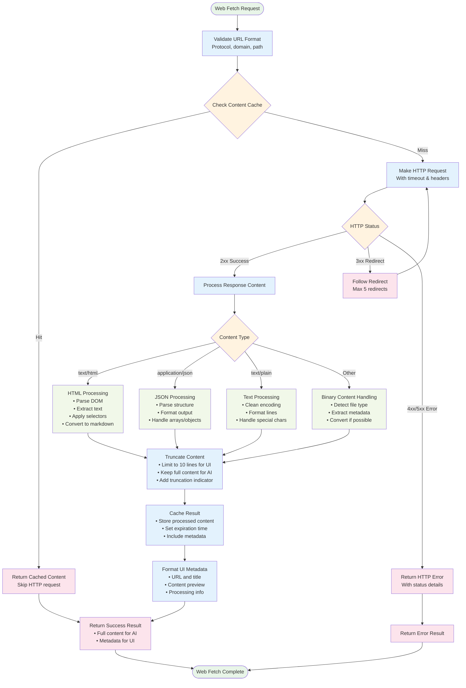

---

## Task Delegation Tools Flow

### Task Tool with Sub-agent Coordination

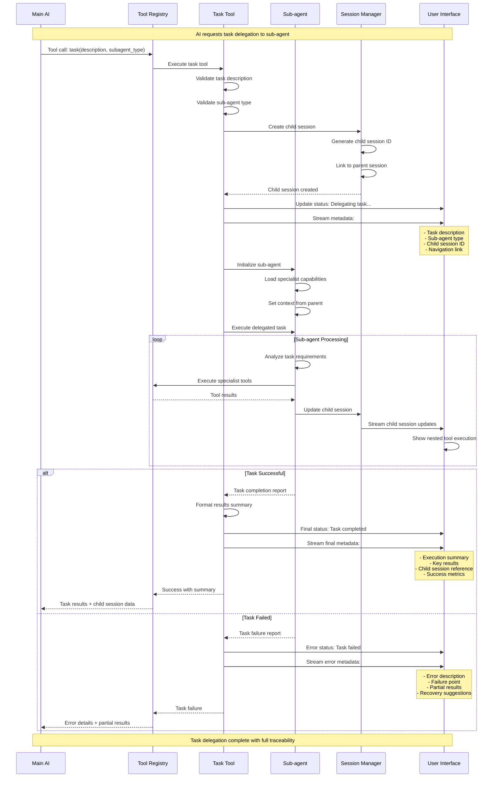

### Sub-agent Specialization Matrix

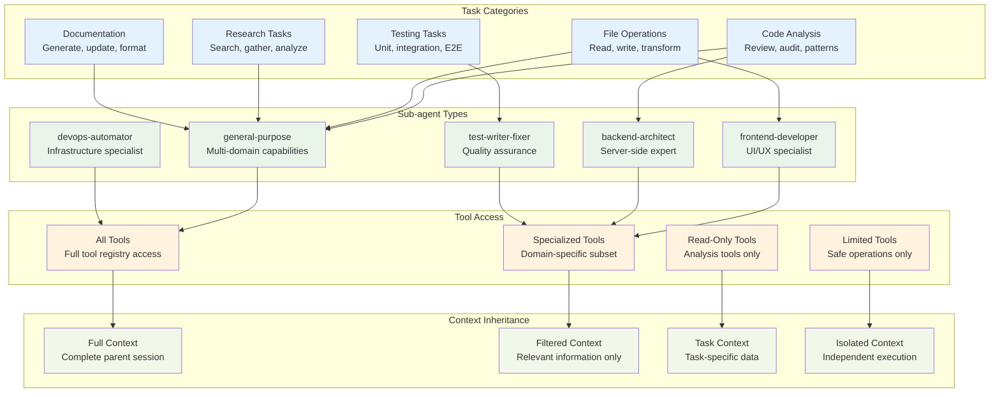

---

## Permission Integration Flow

### Cross-Tool Permission Management

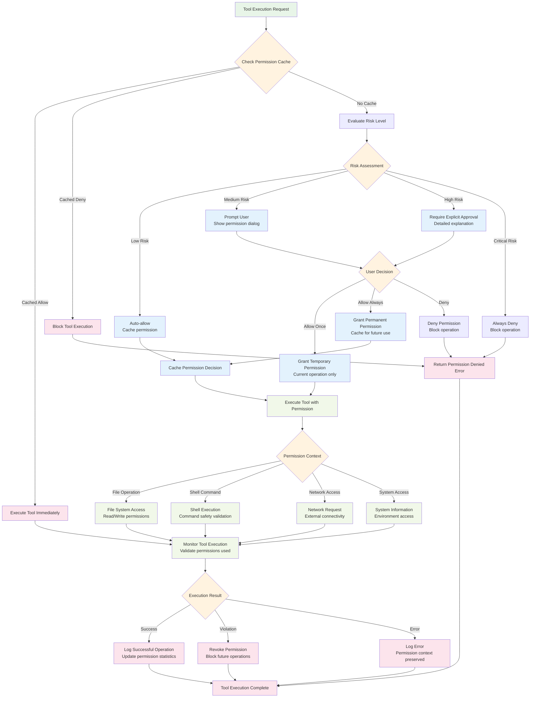

---

## Error Handling and Recovery

### Tool Error Recovery Strategies

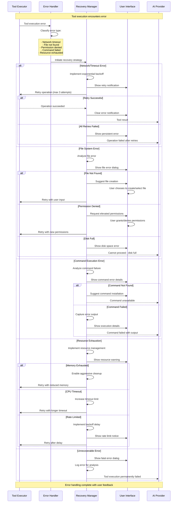

## Implementation Summary

These tool execution flow diagrams provide comprehensive coverage of:

### 🛠 **Tool Categories Covered**
- **File Operations**: read, write, edit with LSP integration and syntax highlighting
- **Shell Commands**: bash execution with real-time streaming and security validation
- **Todo Management**: todoread/todowrite with state persistence and UI formatting
- **Web Fetching**: HTTP requests with content processing and caching
- **Task Delegation**: Sub-agent coordination with specialist capabilities

### 🔒 **Security and Permissions**
- **Risk Assessment**: Multi-level security categorization
- **Permission Management**: Cached decisions with context awareness
- **Command Validation**: Safety checks for shell operations
- **Network Controls**: Secure web access with user approval

### 🚀 **Performance Features**
- **Real-time Streaming**: Live updates for bash and file operations
- **Intelligent Caching**: Content caching with expiration and invalidation
- **Resource Management**: Memory, CPU, and timeout controls
- **Error Recovery**: Comprehensive retry strategies with user guidance

### 🎨 **User Experience**
- **Visual Feedback**: Status indicators, progress animations, and error states
- **Interactive Elements**: Todo checkboxes, terminal displays, and diff viewers
- **Permission Dialogs**: Clear explanations and risk assessment
- **Error Handling**: Graceful degradation with recovery suggestions

These diagrams serve as a complete implementation guide for building tool execution systems that match OpenCode's sophisticated functionality while maintaining security, performance, and excellent user experience.