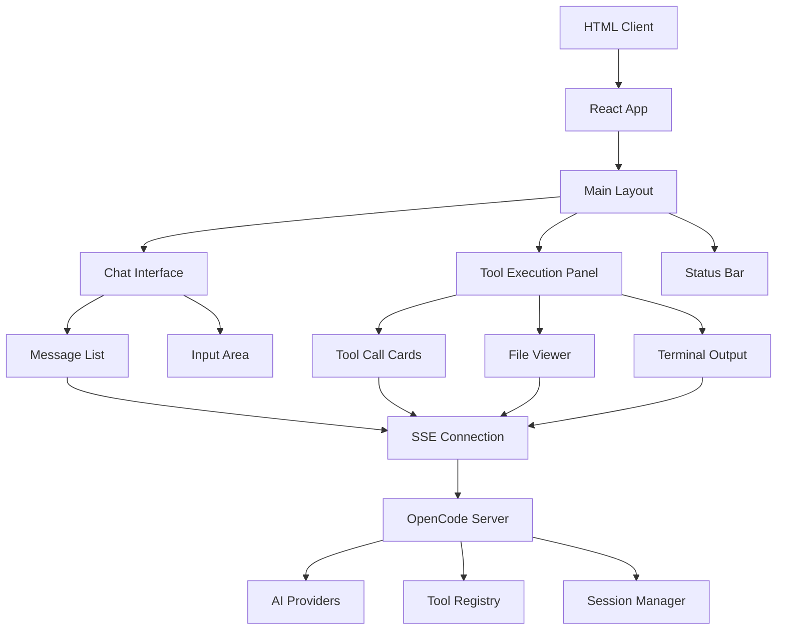
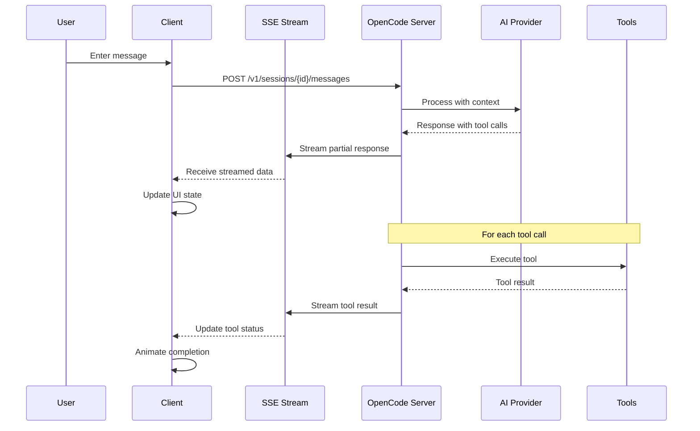

# OpenCode Complete HTML Implementation Guide

**A comprehensive guide for implementing a full-featured HTML clone of OpenCode TUI with complete functional parity**

---

## 🎯 Executive Summary

This guide provides complete technical specifications for creating an HTML-based clone of OpenCode's Terminal User Interface (TUI) with full functional parity. The implementation uses React + TypeScript + Zustand architecture to replicate the sophisticated real-time AI coding agent interface.

### Key Technical Foundations
- **Real-Time Communication**: Server-Sent Events (SSE) for streaming, not WebSockets
- **Architecture**: Component-based React with Zustand state management
- **Tool Execution**: Sophisticated state machine with animations (pending → running → completed/error)
- **UI Framework**: Modern responsive design supporting 25+ themes
- **Performance**: Virtual scrolling and optimized rendering for large outputs

### Core Capabilities to Implement
- **AI Agent Chat Interface**: Multi-provider support (Anthropic, OpenAI, Google, Local)
- **Real-Time Tool Execution**: File operations, shell commands, web fetch, task delegation
- **Permission System**: Risk assessment with user approval workflows
- **Syntax Highlighting**: LSP integration for file operations with diff visualization
- **Todo Management**: Session-scoped state with interactive updates
- **Theme System**: Dynamic theming with CSS custom properties
- **Error Handling**: Comprehensive retry strategies with user feedback

---

## 📋 Quick Start Implementation Roadmap

### Phase 1: Foundation (Weeks 1-2)
```typescript
// Core architecture setup
- React + TypeScript + Vite project structure
- Zustand store configuration for global state
- SSE connection management with reconnection logic
- Basic layout components (header, sidebar, main content)
- Theme system with CSS custom properties
```

### Phase 2: Communication Layer (Weeks 3-4)
```typescript
// API and streaming implementation
- REST API client for sessions, messages, tools
- SSE stream processing with message parsing
- Authentication and session management
- Error handling with retry mechanisms
```

### Phase 3: Tool System (Weeks 5-8)
```typescript
// Tool execution and visualization
- Tool call state machine (pending/running/completed/error)
- File operation components with syntax highlighting
- Shell command streaming with ANSI escape code processing
- Todo management with real-time updates
- Permission system with risk assessment UI
```

### Phase 4: Advanced Features (Weeks 9-12)
```typescript
// Performance and UX enhancements
- Virtual scrolling for large outputs
- Context menu system with keyboard shortcuts
- Drag-and-drop file operations
- Advanced search and filtering
- Export capabilities
```

### Phase 5: Polish & Testing (Weeks 13-14)
```typescript
// Final implementation details
- Comprehensive testing suite
- Performance optimization
- Accessibility compliance
- Documentation and deployment
```

---

## 🏗️ System Architecture Overview

### High-Level Component Architecture


### Data Flow Architecture


---

## 💻 Core Implementation Components

### 1. Application Shell
```typescript
// src/App.tsx - Main application component
import { useOpenCodeStore } from './stores/openCodeStore'
import { ThemeProvider } from './contexts/ThemeContext'
import { MainLayout } from './components/layout/MainLayout'
import { SSEProvider } from './providers/SSEProvider'

export default function App() {
  return (
    <ThemeProvider>
      <SSEProvider>
        <MainLayout />
      </SSEProvider>
    </ThemeProvider>
  )
}
```

### 2. State Management
```typescript
// src/stores/openCodeStore.ts - Zustand store
interface OpenCodeState {
  // Session Management
  currentSession: Session | null
  sessions: Session[]
  
  // Messages and Tool Calls
  messages: Message[]
  toolCalls: ToolCall[]
  
  // UI State
  sidebarCollapsed: boolean
  currentTheme: string
  
  // Connection State
  connected: boolean
  connecting: boolean
  lastError: string | null
}

export const useOpenCodeStore = create<OpenCodeState>((set, get) => ({
  // State properties and actions
}))
```

### 3. SSE Communication
```typescript
// src/services/sseService.ts - Server-Sent Events client
export class SSEService {
  private eventSource: EventSource | null = null
  private reconnectAttempts = 0
  private maxReconnectAttempts = 5
  
  connect(sessionId: string) {
    const url = `${API_BASE_URL}/v1/sessions/${sessionId}/events`
    this.eventSource = new EventSource(url)
    
    this.eventSource.onmessage = this.handleMessage
    this.eventSource.onerror = this.handleError
  }
  
  private handleMessage = (event: MessageEvent) => {
    const data = JSON.parse(event.data)
    
    switch (data.type) {
      case 'message_start':
        this.handleMessageStart(data)
        break
      case 'message_delta':
        this.handleMessageDelta(data)
        break
      case 'tool_call_start':
        this.handleToolCallStart(data)
        break
      case 'tool_call_result':
        this.handleToolCallResult(data)
        break
    }
  }
}
```

---

## 🔧 Tool Execution System

### Tool State Machine
```typescript
// src/types/toolTypes.ts - Tool execution states
export type ToolCallState = 'pending' | 'running' | 'completed' | 'error'

export interface ToolCall {
  id: string
  name: string
  parameters: Record<string, any>
  state: ToolCallState
  result?: any
  error?: string
  startTime?: number
  endTime?: number
  
  // UI State
  expanded: boolean
  showDetails: boolean
}

// Tool execution visualization component
export function ToolCallCard({ toolCall }: { toolCall: ToolCall }) {
  return (
    <div className={`tool-call tool-call--${toolCall.state}`}>
      <div className="tool-call__header">
        <ToolIcon name={toolCall.name} />
        <span className="tool-call__name">{toolCall.name}</span>
        <ToolStateIndicator state={toolCall.state} />
      </div>
      
      {toolCall.state === 'running' && (
        <ShimmerAnimation className="tool-call__progress" />
      )}
      
      <ToolResult toolCall={toolCall} />
    </div>
  )
}
```

### File Operation Components
```typescript
// src/components/tools/FileOperationTool.tsx
export function FileOperationTool({ toolCall }: { toolCall: ToolCall }) {
  const { name, parameters, result } = toolCall
  
  return (
    <div className="file-operation">
      <div className="file-operation__header">
        <FileIcon type={getFileType(parameters.file_path)} />
        <code className="file-path">{parameters.file_path}</code>
      </div>
      
      {name === 'write' && (
        <CodeBlock
          language={getLanguageFromPath(parameters.file_path)}
          content={parameters.content}
          showLineNumbers
          highlightChanges
        />
      )}
      
      {name === 'edit' && result && (
        <DiffViewer
          oldContent={result.old_content}
          newContent={result.new_content}
          filePath={parameters.file_path}
        />
      )}
    </div>
  )
}
```

### Todo Management System
```typescript
// src/components/tools/TodoTool.tsx
export function TodoTool({ toolCall }: { toolCall: ToolCall }) {
  const todos = parseTodoResult(toolCall.result)
  
  return (
    <div className="todo-tool">
      <div className="todo-header">
        <ChecklistIcon />
        <span>Todo List ({todos.length} items)</span>
      </div>
      
      <div className="todo-list">
        {todos.map((todo, index) => (
          <TodoItem
            key={index}
            todo={todo}
            index={index}
            animate={toolCall.state === 'running'}
          />
        ))}
      </div>
    </div>
  )
}

function TodoItem({ todo, index, animate }: TodoItemProps) {
  return (
    <div className={`todo-item todo-item--${todo.status}`}>
      <div className="todo-item__indicator">
        {todo.status === 'completed' && <CheckIcon />}
        {todo.status === 'in_progress' && animate && <SpinnerIcon />}
        {todo.status === 'pending' && <CircleIcon />}
      </div>
      
      <div className="todo-item__content">
        <span className="todo-item__text">{todo.content}</span>
        {todo.status === 'in_progress' && (
          <span className="todo-item__active">{todo.activeForm}</span>
        )}
      </div>
    </div>
  )
}
```

---

## 📊 Detailed Technical Specifications

### API Communication Layer

#### REST API Endpoints
```typescript
// Core API endpoints for OpenCode integration
const API_ENDPOINTS = {
  // Session Management
  sessions: {
    list: 'GET /v1/sessions',
    create: 'POST /v1/sessions',
    get: 'GET /v1/sessions/{id}',
    delete: 'DELETE /v1/sessions/{id}'
  },
  
  // Messages
  messages: {
    create: 'POST /v1/sessions/{sessionId}/messages',
    list: 'GET /v1/sessions/{sessionId}/messages'
  },
  
  // Tools
  tools: {
    list: 'GET /v1/tools',
    execute: 'POST /v1/tools/{name}/execute'
  },
  
  // Configuration
  config: {
    get: 'GET /v1/config',
    update: 'PUT /v1/config'
  },
  
  // Real-time Events
  events: 'GET /v1/sessions/{sessionId}/events' // SSE endpoint
}
```

#### SSE Message Format
```typescript
// Message types received via Server-Sent Events
export interface SSEMessage {
  type: 'message_start' | 'message_delta' | 'message_end' |
        'tool_call_start' | 'tool_call_delta' | 'tool_call_result' |
        'error' | 'connection_state'
  data: any
  timestamp: string
  session_id: string
}

// Example SSE message processing
function processSSEMessage(event: MessageEvent) {
  const message: SSEMessage = JSON.parse(event.data)
  
  switch (message.type) {
    case 'message_start':
      store.addMessage({
        id: message.data.id,
        role: message.data.role,
        content: '',
        timestamp: message.timestamp
      })
      break
      
    case 'message_delta':
      store.updateMessageContent(
        message.data.id,
        message.data.content
      )
      break
      
    case 'tool_call_start':
      store.addToolCall({
        id: message.data.id,
        name: message.data.name,
        parameters: message.data.parameters,
        state: 'running',
        startTime: Date.now()
      })
      break
      
    case 'tool_call_result':
      store.updateToolCall(message.data.id, {
        state: 'completed',
        result: message.data.result,
        endTime: Date.now()
      })
      break
  }
}
```

### Component Hierarchy

#### Main Layout Structure
```typescript
// src/components/layout/MainLayout.tsx
export function MainLayout() {
  return (
    <div className="opencode-layout">
      <Header />
      <div className="opencode-body">
        <Sidebar />
        <MainContent />
      </div>
      <StatusBar />
    </div>
  )
}

// src/components/layout/MainContent.tsx
export function MainContent() {
  const { currentView } = useOpenCodeStore()
  
  return (
    <div className="main-content">
      {currentView === 'chat' && <ChatInterface />}
      {currentView === 'files' && <FileExplorer />}
      {currentView === 'settings' && <SettingsPanel />}
    </div>
  )
}
```

#### Chat Interface Components
```typescript
// src/components/chat/ChatInterface.tsx
export function ChatInterface() {
  const { messages, toolCalls } = useOpenCodeStore()
  
  return (
    <div className="chat-interface">
      <MessageList messages={messages} />
      <ToolExecutionPanel toolCalls={toolCalls} />
      <ChatInput />
    </div>
  )
}

// src/components/chat/MessageList.tsx
export function MessageList({ messages }: { messages: Message[] }) {
  const listRef = useRef<HTMLDivElement>(null)
  
  // Auto-scroll to bottom on new messages
  useEffect(() => {
    if (listRef.current) {
      listRef.current.scrollTop = listRef.current.scrollHeight
    }
  }, [messages])
  
  return (
    <div ref={listRef} className="message-list">
      {messages.map((message) => (
        <MessageBubble key={message.id} message={message} />
      ))}
    </div>
  )
}
```

### Tool Execution Pipeline

#### Tool Registry and Execution
```typescript
// src/services/toolRegistry.ts - Client-side tool registry
export class ToolRegistry {
  private tools = new Map<string, ToolDefinition>()
  
  register(tool: ToolDefinition) {
    this.tools.set(tool.name, tool)
  }
  
  getRenderer(toolName: string): ComponentType<ToolRendererProps> | null {
    const tool = this.tools.get(toolName)
    return tool?.renderer || null
  }
  
  getIcon(toolName: string): string {
    const tool = this.tools.get(toolName)
    return tool?.icon || 'default'
  }
}

// Tool definitions with custom renderers
const TOOL_DEFINITIONS: ToolDefinition[] = [
  {
    name: 'read',
    icon: 'file-text',
    renderer: FileReadTool,
    description: 'Read file contents'
  },
  {
    name: 'write',
    icon: 'file-edit',
    renderer: FileWriteTool,
    description: 'Write file contents'
  },
  {
    name: 'edit',
    icon: 'file-edit',
    renderer: FileEditTool,
    description: 'Edit file with changes'
  },
  {
    name: 'bash',
    icon: 'terminal',
    renderer: BashTool,
    description: 'Execute shell commands'
  },
  {
    name: 'todowrite',
    icon: 'checklist',
    renderer: TodoTool,
    description: 'Manage todo lists'
  }
]
```

#### File Operations with Syntax Highlighting
```typescript
// src/components/tools/FileReadTool.tsx
export function FileReadTool({ toolCall }: ToolRendererProps) {
  const { parameters, result, state } = toolCall
  
  if (state === 'running') {
    return (
      <div className="file-tool file-tool--loading">
        <div className="file-tool__header">
          <FileIcon />
          <code>{parameters.file_path}</code>
          <ShimmerLoader />
        </div>
        <div className="file-tool__placeholder">
          <SkeletonText lines={5} />
        </div>
      </div>
    )
  }
  
  if (state === 'completed' && result) {
    return (
      <div className="file-tool file-tool--completed">
        <div className="file-tool__header">
          <FileIcon />
          <code>{parameters.file_path}</code>
          <span className="file-tool__size">
            {result.content.split('\n').length} lines
          </span>
        </div>
        
        <CodeHighlight
          language={getLanguageFromPath(parameters.file_path)}
          content={result.content}
          showLineNumbers
          wrapLongLines
          maxHeight="400px"
        />
      </div>
    )
  }
  
  return <ToolErrorState toolCall={toolCall} />
}
```

#### Shell Command Execution
```typescript
// src/components/tools/BashTool.tsx
export function BashTool({ toolCall }: ToolRendererProps) {
  const { parameters, result, state } = toolCall
  const [output, setOutput] = useState<string[]>([])
  
  // Stream output processing
  useEffect(() => {
    if (state === 'running' && result?.stream) {
      const lines = result.stream.split('\n')
      setOutput(prev => [...prev, ...lines])
    }
  }, [state, result])
  
  return (
    <div className="bash-tool">
      <div className="bash-tool__header">
        <TerminalIcon />
        <code className="bash-tool__command">{parameters.command}</code>
        {state === 'running' && <SpinnerIcon />}
      </div>
      
      <div className="bash-tool__output">
        <Terminal
          lines={output}
          processAnsiEscapes
          showTimestamps={false}
          maxLines={1000}
        />
      </div>
      
      {state === 'completed' && result && (
        <div className="bash-tool__footer">
          <span className={`exit-code exit-code--${result.exit_code === 0 ? 'success' : 'error'}`}>
            Exit code: {result.exit_code}
          </span>
          <span className="execution-time">
            {result.execution_time}ms
          </span>
        </div>
      )}
    </div>
  )
}
```

### State Management Deep Dive

#### Zustand Store Implementation
```typescript
// src/stores/openCodeStore.ts - Complete store implementation
interface OpenCodeState {
  // Session State
  currentSession: Session | null
  sessions: Session[]
  
  // Chat State
  messages: Message[]
  toolCalls: ToolCall[]
  streamingMessage: Partial<Message> | null
  
  // UI State
  theme: string
  sidebarCollapsed: boolean
  activePanel: 'chat' | 'files' | 'settings'
  
  // Connection State
  connected: boolean
  connecting: boolean
  reconnectAttempts: number
  lastError: string | null
  
  // Actions
  setCurrentSession: (session: Session) => void
  addMessage: (message: Message) => void
  updateMessage: (id: string, updates: Partial<Message>) => void
  addToolCall: (toolCall: ToolCall) => void
  updateToolCall: (id: string, updates: Partial<ToolCall>) => void
  setConnectionState: (connected: boolean) => void
  setTheme: (theme: string) => void
  toggleSidebar: () => void
}

export const useOpenCodeStore = create<OpenCodeState>()(
  subscribeWithSelector((set, get) => ({
    // Initial state
    currentSession: null,
    sessions: [],
    messages: [],
    toolCalls: [],
    streamingMessage: null,
    theme: 'default',
    sidebarCollapsed: false,
    activePanel: 'chat',
    connected: false,
    connecting: false,
    reconnectAttempts: 0,
    lastError: null,
    
    // Actions
    setCurrentSession: (session) => {
      set({ currentSession: session })
      // Load session messages and tool calls
      loadSessionData(session.id)
    },
    
    addMessage: (message) => {
      set((state) => ({
        messages: [...state.messages, message]
      }))
    },
    
    updateMessage: (id, updates) => {
      set((state) => ({
        messages: state.messages.map((msg) =>
          msg.id === id ? { ...msg, ...updates } : msg
        )
      }))
    },
    
    addToolCall: (toolCall) => {
      set((state) => ({
        toolCalls: [...state.toolCalls, toolCall]
      }))
    },
    
    updateToolCall: (id, updates) => {
      set((state) => ({
        toolCalls: state.toolCalls.map((tc) =>
          tc.id === id ? { ...tc, ...updates } : tc
        )
      }))
    },
    
    setConnectionState: (connected) => {
      set({ connected, lastError: connected ? null : get().lastError })
    },
    
    setTheme: (theme) => {
      set({ theme })
      document.documentElement.setAttribute('data-theme', theme)
    },
    
    toggleSidebar: () => {
      set((state) => ({ sidebarCollapsed: !state.sidebarCollapsed }))
    }
  }))
)
```

#### Persistent State Management
```typescript
// src/stores/persistentStore.ts - Local storage integration
import { persist } from 'zustand/middleware'

const persistedStore = persist(
  useOpenCodeStore,
  {
    name: 'opencode-storage',
    partialize: (state) => ({
      // Only persist UI preferences
      theme: state.theme,
      sidebarCollapsed: state.sidebarCollapsed,
      activePanel: state.activePanel
    })
  }
)
```

### Theme System Implementation

#### CSS Custom Properties for Theming
```css
/* src/styles/themes/base.css - Base theme variables */
:root {
  /* Color Palette */
  --color-primary: #007acc;
  --color-secondary: #6c757d;
  --color-success: #28a745;
  --color-warning: #ffc107;
  --color-error: #dc3545;
  --color-info: #17a2b8;
  
  /* Background Colors */
  --bg-primary: #ffffff;
  --bg-secondary: #f8f9fa;
  --bg-tertiary: #e9ecef;
  --bg-overlay: rgba(0, 0, 0, 0.1);
  
  /* Text Colors */
  --text-primary: #212529;
  --text-secondary: #6c757d;
  --text-muted: #868e96;
  --text-inverse: #ffffff;
  
  /* Border Colors */
  --border-primary: #dee2e6;
  --border-secondary: #ced4da;
  --border-focus: var(--color-primary);
  
  /* Shadow Definitions */
  --shadow-sm: 0 1px 2px rgba(0, 0, 0, 0.05);
  --shadow-md: 0 4px 6px rgba(0, 0, 0, 0.1);
  --shadow-lg: 0 10px 15px rgba(0, 0, 0, 0.1);
  
  /* Tool-specific Colors */
  --tool-pending: #ffc107;
  --tool-running: #007acc;
  --tool-completed: #28a745;
  --tool-error: #dc3545;
}

/* Dark theme overrides */
[data-theme="dark"] {
  --bg-primary: #1a1a1a;
  --bg-secondary: #2d2d2d;
  --bg-tertiary: #404040;
  --text-primary: #ffffff;
  --text-secondary: #cccccc;
  --text-muted: #999999;
  --border-primary: #404040;
  --border-secondary: #555555;
}
```

#### Dynamic Theme Loading
```typescript
// src/contexts/ThemeContext.tsx
interface ThemeContextType {
  currentTheme: string
  availableThemes: Theme[]
  setTheme: (themeName: string) => void
  toggleTheme: () => void
}

export function ThemeProvider({ children }: { children: React.ReactNode }) {
  const [currentTheme, setCurrentTheme] = useState('default')
  const [availableThemes, setAvailableThemes] = useState<Theme[]>([])
  
  useEffect(() => {
    // Load available themes
    loadAvailableThemes().then(setAvailableThemes)
  }, [])
  
  const setTheme = useCallback((themeName: string) => {
    setCurrentTheme(themeName)
    document.documentElement.setAttribute('data-theme', themeName)
    
    // Load theme-specific CSS if needed
    loadThemeCSS(themeName)
  }, [])
  
  return (
    <ThemeContext.Provider value={{
      currentTheme,
      availableThemes,
      setTheme,
      toggleTheme: () => setTheme(currentTheme === 'dark' ? 'light' : 'dark')
    }}>
      {children}
    </ThemeContext.Provider>
  )
}
```

### Performance Optimization Strategies

#### Virtual Scrolling for Large Content
```typescript
// src/components/ui/VirtualList.tsx
export function VirtualList<T>({
  items,
  itemHeight,
  containerHeight,
  renderItem
}: VirtualListProps<T>) {
  const [scrollTop, setScrollTop] = useState(0)
  
  const visibleItems = useMemo(() => {
    const start = Math.floor(scrollTop / itemHeight)
    const end = Math.min(
      start + Math.ceil(containerHeight / itemHeight) + 1,
      items.length
    )
    
    return items.slice(start, end).map((item, index) => ({
      item,
      index: start + index
    }))
  }, [items, scrollTop, itemHeight, containerHeight])
  
  return (
    <div
      className="virtual-list"
      style={{ height: containerHeight }}
      onScroll={(e) => setScrollTop(e.currentTarget.scrollTop)}
    >
      <div style={{ height: items.length * itemHeight, position: 'relative' }}>
        {visibleItems.map(({ item, index }) => (
          <div
            key={index}
            style={{
              position: 'absolute',
              top: index * itemHeight,
              height: itemHeight,
              width: '100%'
            }}
          >
            {renderItem(item, index)}
          </div>
        ))}
      </div>
    </div>
  )
}
```

#### Memoization for Tool Components
```typescript
// src/components/tools/MemoizedToolCard.tsx
export const MemoizedToolCard = React.memo(function ToolCard({ 
  toolCall 
}: { 
  toolCall: ToolCall 
}) {
  // Only re-render if tool call state or result changes
  return <ToolCallCard toolCall={toolCall} />
}, (prevProps, nextProps) => {
  return (
    prevProps.toolCall.state === nextProps.toolCall.state &&
    prevProps.toolCall.result === nextProps.toolCall.result &&
    prevProps.toolCall.error === nextProps.toolCall.error
  )
})
```

#### Code Splitting and Lazy Loading
```typescript
// src/components/lazy/LazyComponents.tsx
const CodeHighlight = lazy(() => import('../ui/CodeHighlight'))
const DiffViewer = lazy(() => import('../ui/DiffViewer'))
const Terminal = lazy(() => import('../ui/Terminal'))

// Wrapper with loading fallback
export function LazyCodeHighlight(props: CodeHighlightProps) {
  return (
    <Suspense fallback={<SkeletonCodeBlock />}>
      <CodeHighlight {...props} />
    </Suspense>
  )
}
```

### Error Handling and Recovery

#### Error Boundary Implementation
```typescript
// src/components/error/ErrorBoundary.tsx
interface ErrorBoundaryState {
  hasError: boolean
  error: Error | null
  errorInfo: ErrorInfo | null
}

export class ErrorBoundary extends Component<
  { children: ReactNode; fallback?: ComponentType<any> },
  ErrorBoundaryState
> {
  constructor(props: any) {
    super(props)
    this.state = { hasError: false, error: null, errorInfo: null }
  }
  
  static getDerivedStateFromError(error: Error): Partial<ErrorBoundaryState> {
    return { hasError: true, error }
  }
  
  componentDidCatch(error: Error, errorInfo: ErrorInfo) {
    console.error('Error caught by boundary:', error, errorInfo)
    this.setState({ errorInfo })
    
    // Send error to monitoring service
    errorReporting.captureException(error, {
      tags: { component: 'ErrorBoundary' },
      extra: errorInfo
    })
  }
  
  render() {
    if (this.state.hasError) {
      const FallbackComponent = this.props.fallback || ErrorFallback
      return <FallbackComponent error={this.state.error} />
    }
    
    return this.props.children
  }
}
```

#### Retry Logic for API Calls
```typescript
// src/services/apiClient.ts
export class APIClient {
  private async requestWithRetry<T>(
    fn: () => Promise<T>,
    maxRetries = 3,
    delay = 1000
  ): Promise<T> {
    let lastError: Error
    
    for (let attempt = 1; attempt <= maxRetries; attempt++) {
      try {
        return await fn()
      } catch (error) {
        lastError = error as Error
        
        if (attempt === maxRetries) break
        
        // Exponential backoff
        const waitTime = delay * Math.pow(2, attempt - 1)
        await new Promise(resolve => setTimeout(resolve, waitTime))
        
        console.warn(`API call failed, retrying (${attempt}/${maxRetries})`, error)
      }
    }
    
    throw lastError!
  }
  
  async sendMessage(sessionId: string, content: string) {
    return this.requestWithRetry(() =>
      fetch(`/v1/sessions/${sessionId}/messages`, {
        method: 'POST',
        headers: { 'Content-Type': 'application/json' },
        body: JSON.stringify({ content })
      }).then(res => {
        if (!res.ok) throw new Error(`HTTP ${res.status}`)
        return res.json()
      })
    )
  }
}
```

### Testing Strategy

#### Unit Tests for Components
```typescript
// src/components/tools/__tests__/FileReadTool.test.tsx
describe('FileReadTool', () => {
  it('should render loading state correctly', () => {
    const toolCall: ToolCall = {
      id: '1',
      name: 'read',
      parameters: { file_path: '/test/file.txt' },
      state: 'running'
    }
    
    render(<FileReadTool toolCall={toolCall} />)
    
    expect(screen.getByText('/test/file.txt')).toBeInTheDocument()
    expect(screen.getByTestId('shimmer-loader')).toBeInTheDocument()
  })
  
  it('should render file content when completed', () => {
    const toolCall: ToolCall = {
      id: '1',
      name: 'read',
      parameters: { file_path: '/test/file.txt' },
      state: 'completed',
      result: { content: 'console.log("Hello, world!")' }
    }
    
    render(<FileReadTool toolCall={toolCall} />)
    
    expect(screen.getByText('console.log("Hello, world!")')).toBeInTheDocument()
  })
})
```

#### Integration Tests for SSE
```typescript
// src/services/__tests__/sseService.test.ts
describe('SSEService', () => {
  let mockEventSource: jest.Mocked<EventSource>
  
  beforeEach(() => {
    mockEventSource = {
      addEventListener: jest.fn(),
      removeEventListener: jest.fn(),
      close: jest.fn(),
      onmessage: null,
      onerror: null,
      onopen: null
    } as any
    
    global.EventSource = jest.fn(() => mockEventSource) as any
  })
  
  it('should handle message events correctly', () => {
    const service = new SSEService()
    const mockStore = { addMessage: jest.fn(), updateMessage: jest.fn() }
    
    service.connect('session-123', mockStore)
    
    // Simulate message event
    const messageEvent = new MessageEvent('message', {
      data: JSON.stringify({
        type: 'message_start',
        data: { id: 'msg-1', role: 'assistant', content: '' }
      })
    })
    
    mockEventSource.onmessage!(messageEvent)
    
    expect(mockStore.addMessage).toHaveBeenCalledWith({
      id: 'msg-1',
      role: 'assistant',
      content: ''
    })
  })
})
```

#### End-to-End Tests with Playwright
```typescript
// tests/e2e/chatInterface.spec.ts
import { test, expect } from '@playwright/test'

test('should send message and receive response', async ({ page }) => {
  await page.goto('/')
  
  // Wait for connection
  await expect(page.locator('.connection-status')).toHaveText('Connected')
  
  // Send message
  await page.fill('[data-testid="chat-input"]', 'Hello, OpenCode!')
  await page.click('[data-testid="send-button"]')
  
  // Wait for message to appear
  await expect(page.locator('.message-bubble').last()).toContainText('Hello, OpenCode!')
  
  // Wait for AI response
  await expect(page.locator('.message-bubble[data-role="assistant"]')).toBeVisible()
})

test('should execute tool calls and show results', async ({ page }) => {
  await page.goto('/')
  
  // Send message that triggers tool call
  await page.fill('[data-testid="chat-input"]', 'Read package.json')
  await page.click('[data-testid="send-button"]')
  
  // Wait for tool call to appear
  await expect(page.locator('.tool-call')).toBeVisible()
  await expect(page.locator('.tool-call__name')).toContainText('read')
  
  // Wait for completion
  await expect(page.locator('.tool-call--completed')).toBeVisible()
  
  // Check file content is displayed
  await expect(page.locator('.code-highlight')).toBeVisible()
})
```

---

## 📈 Advanced Implementation Details

### Real-Time Animation System

#### Shimmer Effects for Loading States
```typescript
// src/components/ui/ShimmerLoader.tsx
export function ShimmerLoader({ 
  className = '',
  variant = 'default' 
}: ShimmerProps) {
  return (
    <div className={`shimmer shimmer--${variant} ${className}`}>
      <div className="shimmer__content" />
    </div>
  )
}

// CSS for shimmer animation
.shimmer {
  position: relative;
  overflow: hidden;
  background: var(--bg-secondary);
}

.shimmer::before {
  content: '';
  position: absolute;
  top: 0;
  left: -100%;
  width: 100%;
  height: 100%;
  background: linear-gradient(
    90deg,
    transparent,
    rgba(255, 255, 255, 0.2),
    transparent
  );
  animation: shimmer 2s infinite;
}

@keyframes shimmer {
  0% { left: -100%; }
  100% { left: 100%; }
}
```

#### Progressive Loading Animations
```typescript
// src/hooks/useProgressiveReveal.ts
export function useProgressiveReveal(
  items: any[],
  delay = 100
): [any[], boolean] {
  const [revealedItems, setRevealedItems] = useState<any[]>([])
  const [isComplete, setIsComplete] = useState(false)
  
  useEffect(() => {
    if (items.length === 0) return
    
    let currentIndex = 0
    const interval = setInterval(() => {
      if (currentIndex < items.length) {
        setRevealedItems(items.slice(0, currentIndex + 1))
        currentIndex++
      } else {
        setIsComplete(true)
        clearInterval(interval)
      }
    }, delay)
    
    return () => clearInterval(interval)
  }, [items, delay])
  
  return [revealedItems, isComplete]
}
```

### Advanced File Operations

#### Diff Visualization Component
```typescript
// src/components/ui/DiffViewer.tsx
export function DiffViewer({
  oldContent,
  newContent,
  filePath
}: DiffViewerProps) {
  const diffs = useMemo(() => 
    computeDiff(oldContent, newContent), 
    [oldContent, newContent]
  )
  
  return (
    <div className="diff-viewer">
      <div className="diff-viewer__header">
        <FileIcon />
        <span className="diff-viewer__path">{filePath}</span>
        <div className="diff-viewer__stats">
          <span className="additions">+{diffs.additions}</span>
          <span className="deletions">-{diffs.deletions}</span>
        </div>
      </div>
      
      <div className="diff-viewer__content">
        {diffs.hunks.map((hunk, index) => (
          <DiffHunk key={index} hunk={hunk} />
        ))}
      </div>
    </div>
  )
}

function DiffHunk({ hunk }: { hunk: DiffHunk }) {
  return (
    <div className="diff-hunk">
      <div className="diff-hunk__header">
        @@ -{hunk.oldStart},{hunk.oldLines} +{hunk.newStart},{hunk.newLines} @@
      </div>
      
      {hunk.lines.map((line, index) => (
        <div 
          key={index}
          className={`diff-line diff-line--${line.type}`}
        >
          <span className="diff-line__number">{line.lineNumber}</span>
          <span className="diff-line__indicator">{line.indicator}</span>
          <span className="diff-line__content">{line.content}</span>
        </div>
      ))}
    </div>
  )
}
```

#### Syntax Highlighting with Language Detection
```typescript
// src/components/ui/CodeHighlight.tsx
import Prism from 'prismjs'
import 'prismjs/themes/prism-tomorrow.css'

export function CodeHighlight({
  content,
  language,
  showLineNumbers = false,
  maxHeight,
  highlightLines = []
}: CodeHighlightProps) {
  const detectedLanguage = language || detectLanguage(content)
  
  const highlightedCode = useMemo(() => {
    if (!detectedLanguage) return content
    
    try {
      return Prism.highlight(
        content,
        Prism.languages[detectedLanguage],
        detectedLanguage
      )
    } catch (error) {
      console.warn('Syntax highlighting failed:', error)
      return content
    }
  }, [content, detectedLanguage])
  
  return (
    <div className="code-highlight">
      <div className="code-highlight__header">
        <span className="code-highlight__language">{detectedLanguage}</span>
        <CopyButton content={content} />
      </div>
      
      <pre
        className="code-highlight__content"
        style={{ maxHeight }}
      >
        <code
          dangerouslySetInnerHTML={{ __html: highlightedCode }}
          className={`language-${detectedLanguage}`}
        />
        
        {showLineNumbers && (
          <div className="code-highlight__line-numbers">
            {content.split('\n').map((_, index) => (
              <span
                key={index}
                className={`line-number ${
                  highlightLines.includes(index + 1) ? 'highlighted' : ''
                }`}
              >
                {index + 1}
              </span>
            ))}
          </div>
        )}
      </pre>
    </div>
  )
}
```

### Context Menu and Keyboard Shortcuts

#### Context Menu System
```typescript
// src/components/ui/ContextMenu.tsx
export function ContextMenu({
  items,
  position,
  onClose,
  visible
}: ContextMenuProps) {
  const menuRef = useRef<HTMLDivElement>(null)
  
  useEffect(() => {
    function handleClickOutside(event: MouseEvent) {
      if (menuRef.current && !menuRef.current.contains(event.target as Node)) {
        onClose()
      }
    }
    
    if (visible) {
      document.addEventListener('mousedown', handleClickOutside)
      return () => document.removeEventListener('mousedown', handleClickOutside)
    }
  }, [visible, onClose])
  
  if (!visible) return null
  
  return (
    <div
      ref={menuRef}
      className="context-menu"
      style={{ top: position.y, left: position.x }}
    >
      {items.map((item, index) => (
        <div
          key={index}
          className={`context-menu__item ${item.disabled ? 'disabled' : ''}`}
          onClick={() => !item.disabled && item.onClick()}
        >
          {item.icon && <Icon name={item.icon} />}
          <span>{item.label}</span>
          {item.shortcut && (
            <span className="context-menu__shortcut">{item.shortcut}</span>
          )}
        </div>
      ))}
    </div>
  )
}
```

#### Keyboard Shortcut Handler
```typescript
// src/hooks/useKeyboardShortcuts.ts
export function useKeyboardShortcuts() {
  useEffect(() => {
    function handleKeyDown(event: KeyboardEvent) {
      const { ctrlKey, metaKey, shiftKey, altKey, key } = event
      const modifier = ctrlKey || metaKey
      
      // Command palette
      if (modifier && shiftKey && key === 'P') {
        event.preventDefault()
        openCommandPalette()
        return
      }
      
      // New session
      if (modifier && key === 'n') {
        event.preventDefault()
        createNewSession()
        return
      }
      
      // Toggle sidebar
      if (modifier && key === 'b') {
        event.preventDefault()
        toggleSidebar()
        return
      }
      
      // Focus chat input
      if (key === '/' && !isInputFocused()) {
        event.preventDefault()
        focusChatInput()
        return
      }
    }
    
    document.addEventListener('keydown', handleKeyDown)
    return () => document.removeEventListener('keydown', handleKeyDown)
  }, [])
}
```

### Performance Monitoring and Analytics

#### Performance Metrics Collection
```typescript
// src/services/performanceMonitor.ts
export class PerformanceMonitor {
  private metrics: PerformanceMetric[] = []
  
  startTiming(label: string): string {
    const id = generateId()
    performance.mark(`${label}-start-${id}`)
    return id
  }
  
  endTiming(label: string, id: string): number {
    const endMark = `${label}-end-${id}`
    const startMark = `${label}-start-${id}`
    
    performance.mark(endMark)
    performance.measure(`${label}-${id}`, startMark, endMark)
    
    const measure = performance.getEntriesByName(`${label}-${id}`)[0]
    const duration = measure.duration
    
    this.metrics.push({
      label,
      duration,
      timestamp: Date.now()
    })
    
    // Clean up performance entries
    performance.clearMarks(startMark)
    performance.clearMarks(endMark)
    performance.clearMeasures(`${label}-${id}`)
    
    return duration
  }
  
  getAverageTime(label: string): number {
    const labelMetrics = this.metrics.filter(m => m.label === label)
    if (labelMetrics.length === 0) return 0
    
    const total = labelMetrics.reduce((sum, m) => sum + m.duration, 0)
    return total / labelMetrics.length
  }
}

// Usage in components
export function usePerformanceTracking(label: string) {
  const monitor = useRef(new PerformanceMonitor())
  
  const startTiming = useCallback(() => {
    return monitor.current.startTiming(label)
  }, [label])
  
  const endTiming = useCallback((id: string) => {
    return monitor.current.endTiming(label, id)
  }, [label])
  
  return { startTiming, endTiming }
}
```

### Accessibility Implementation

#### ARIA Labels and Keyboard Navigation
```typescript
// src/components/ui/AccessibleButton.tsx
export function AccessibleButton({
  children,
  onClick,
  disabled = false,
  variant = 'default',
  ariaLabel,
  ariaDescribedBy,
  ...props
}: AccessibleButtonProps) {
  return (
    <button
      className={`btn btn--${variant}`}
      onClick={onClick}
      disabled={disabled}
      aria-label={ariaLabel}
      aria-describedby={ariaDescribedBy}
      {...props}
    >
      {children}
    </button>
  )
}

// Screen reader announcements
export function useScreenReaderAnnouncement() {
  const announceRef = useRef<HTMLDivElement>(null)
  
  const announce = useCallback((message: string, priority: 'polite' | 'assertive' = 'polite') => {
    if (announceRef.current) {
      announceRef.current.textContent = message
      announceRef.current.setAttribute('aria-live', priority)
    }
  }, [])
  
  return {
    announce,
    AnnouncementRegion: () => (
      <div
        ref={announceRef}
        className="sr-only"
        aria-live="polite"
        aria-atomic="true"
      />
    )
  }
}
```

#### Focus Management
```typescript
// src/hooks/useFocusManagement.ts
export function useFocusManagement() {
  const focusableElementsSelector = [
    'button:not([disabled])',
    'input:not([disabled])',
    'select:not([disabled])',
    'textarea:not([disabled])',
    'a[href]',
    '[tabindex]:not([tabindex="-1"])'
  ].join(', ')
  
  const trapFocus = useCallback((container: HTMLElement) => {
    const focusableElements = container.querySelectorAll(focusableElementsSelector)
    const firstElement = focusableElements[0] as HTMLElement
    const lastElement = focusableElements[focusableElements.length - 1] as HTMLElement
    
    const handleKeyDown = (event: KeyboardEvent) => {
      if (event.key === 'Tab') {
        if (event.shiftKey) {
          if (document.activeElement === firstElement) {
            event.preventDefault()
            lastElement.focus()
          }
        } else {
          if (document.activeElement === lastElement) {
            event.preventDefault()
            firstElement.focus()
          }
        }
      }
      
      if (event.key === 'Escape') {
        // Allow escape to close modal/dialog
        container.dispatchEvent(new CustomEvent('escape'))
      }
    }
    
    container.addEventListener('keydown', handleKeyDown)
    firstElement?.focus()
    
    return () => container.removeEventListener('keydown', handleKeyDown)
  }, [])
  
  return { trapFocus }
}
```

### Security Considerations

#### Content Security Policy
```typescript
// src/security/csp.ts - CSP configuration for secure content loading
export const cspDirectives = {
  'default-src': ["'self'"],
  'script-src': ["'self'", "'unsafe-inline'"], // Required for React dev
  'style-src': ["'self'", "'unsafe-inline'"],
  'img-src': ["'self'", "data:", "https:"],
  'font-src': ["'self'"],
  'connect-src': ["'self'", "wss:", "https:"],
  'media-src': ["'none'"],
  'object-src': ["'none'"],
  'frame-src': ["'none'"]
}
```

#### Input Sanitization
```typescript
// src/utils/sanitization.ts - Sanitize user inputs
import DOMPurify from 'dompurify'

export function sanitizeHTML(html: string): string {
  return DOMPurify.sanitize(html, {
    ALLOWED_TAGS: ['code', 'pre', 'span', 'div', 'br'],
    ALLOWED_ATTR: ['class', 'data-language']
  })
}

export function sanitizeFilePath(path: string): string {
  // Remove dangerous path components
  return path
    .replace(/\.\./g, '') // Remove parent directory references
    .replace(/[<>:"|?*]/g, '') // Remove invalid filename characters
    .trim()
}

export function validateJSON(jsonString: string): boolean {
  try {
    JSON.parse(jsonString)
    return true
  } catch {
    return false
  }
}
```

---

## 🚀 Deployment and Production Considerations

### Build Configuration

#### Vite Configuration for Production
```typescript
// vite.config.ts
import { defineConfig } from 'vite'
import react from '@vitejs/plugin-react'
import { resolve } from 'path'

export default defineConfig({
  plugins: [react()],
  
  build: {
    target: 'es2020',
    outDir: 'dist',
    sourcemap: true,
    rollupOptions: {
      output: {
        manualChunks: {
          vendor: ['react', 'react-dom'],
          ui: ['@radix-ui/react-dialog', '@radix-ui/react-dropdown-menu'],
          editor: ['prismjs', 'monaco-editor']
        }
      }
    }
  },
  
  optimizeDeps: {
    include: ['react', 'react-dom', 'zustand']
  },
  
  server: {
    proxy: {
      '/v1': {
        target: 'http://localhost:3000',
        changeOrigin: true
      }
    }
  },
  
  resolve: {
    alias: {
      '@': resolve(__dirname, 'src'),
      '@components': resolve(__dirname, 'src/components'),
      '@services': resolve(__dirname, 'src/services'),
      '@stores': resolve(__dirname, 'src/stores'),
      '@utils': resolve(__dirname, 'src/utils')
    }
  }
})
```

#### Environment Configuration
```typescript
// src/config/environment.ts
interface EnvironmentConfig {
  apiBaseUrl: string
  wsBaseUrl: string
  enableAnalytics: boolean
  enableErrorReporting: boolean
  maxReconnectAttempts: number
  reconnectDelay: number
}

const developmentConfig: EnvironmentConfig = {
  apiBaseUrl: 'http://localhost:3000',
  wsBaseUrl: 'ws://localhost:3000',
  enableAnalytics: false,
  enableErrorReporting: false,
  maxReconnectAttempts: 5,
  reconnectDelay: 1000
}

const productionConfig: EnvironmentConfig = {
  apiBaseUrl: process.env.VITE_API_BASE_URL!,
  wsBaseUrl: process.env.VITE_WS_BASE_URL!,
  enableAnalytics: true,
  enableErrorReporting: true,
  maxReconnectAttempts: 10,
  reconnectDelay: 2000
}

export const config = process.env.NODE_ENV === 'production' 
  ? productionConfig 
  : developmentConfig
```

### Monitoring and Error Reporting

#### Error Reporting Service Integration
```typescript
// src/services/errorReporting.ts
class ErrorReportingService {
  private initialized = false
  
  initialize() {
    if (this.initialized || !config.enableErrorReporting) return
    
    // Initialize Sentry or similar service
    window.addEventListener('error', this.handleError)
    window.addEventListener('unhandledrejection', this.handlePromiseRejection)
    
    this.initialized = true
  }
  
  private handleError = (event: ErrorEvent) => {
    this.captureException(event.error, {
      tags: { type: 'javascript_error' },
      extra: {
        filename: event.filename,
        lineno: event.lineno,
        colno: event.colno
      }
    })
  }
  
  private handlePromiseRejection = (event: PromiseRejectionEvent) => {
    this.captureException(event.reason, {
      tags: { type: 'unhandled_promise_rejection' }
    })
  }
  
  captureException(error: Error, context?: any) {
    if (!config.enableErrorReporting) {
      console.error('Error captured:', error, context)
      return
    }
    
    // Send to error reporting service
    console.error('Error reported:', error, context)
  }
  
  captureMessage(message: string, level: 'info' | 'warning' | 'error' = 'info') {
    if (!config.enableErrorReporting) {
      console.log(`[${level}] ${message}`)
      return
    }
    
    // Send to error reporting service
  }
}

export const errorReporting = new ErrorReportingService()
```

### Performance Monitoring

#### Web Vitals Tracking
```typescript
// src/services/webVitals.ts
import { getCLS, getFID, getFCP, getLCP, getTTFB } from 'web-vitals'

export function initWebVitalsTracking() {
  if (!config.enableAnalytics) return
  
  getCLS(metric => sendToAnalytics('CLS', metric.value))
  getFID(metric => sendToAnalytics('FID', metric.value))
  getFCP(metric => sendToAnalytics('FCP', metric.value))
  getLCP(metric => sendToAnalytics('LCP', metric.value))
  getTTFB(metric => sendToAnalytics('TTFB', metric.value))
}

function sendToAnalytics(metricName: string, value: number) {
  // Send to analytics service
  console.log(`Web Vital ${metricName}:`, value)
}
```

---

## 📝 Final Implementation Checklist

### ✅ Core Features Implementation
- [ ] **SSE Communication Layer**: Real-time streaming with reconnection logic
- [ ] **Tool Execution System**: State machine with animations and result rendering  
- [ ] **File Operations**: Read/write/edit with syntax highlighting and diff visualization
- [ ] **Shell Command Execution**: Terminal emulation with ANSI escape code processing
- [ ] **Todo Management**: Interactive todo lists with real-time updates
- [ ] **Permission System**: Risk assessment with user approval workflows
- [ ] **Theme System**: Dynamic theming supporting 25+ themes
- [ ] **Error Handling**: Comprehensive error boundaries with retry mechanisms

### ✅ Performance Optimizations  
- [ ] **Virtual Scrolling**: For large content and message lists
- [ ] **Component Memoization**: React.memo for tool components  
- [ ] **Code Splitting**: Lazy loading for heavy components
- [ ] **Bundle Optimization**: Tree shaking and chunk splitting
- [ ] **Caching Strategy**: API response caching and state persistence

### ✅ User Experience
- [ ] **Responsive Design**: Mobile-first approach with breakpoints
- [ ] **Keyboard Shortcuts**: Full keyboard navigation support
- [ ] **Context Menus**: Right-click actions for all interactive elements
- [ ] **Accessibility**: WCAG 2.1 AA compliance with screen reader support
- [ ] **Loading States**: Shimmer effects and skeleton screens
- [ ] **Error States**: User-friendly error messages with recovery actions

### ✅ Testing & Quality Assurance
- [ ] **Unit Tests**: Jest/Vitest for components and utilities
- [ ] **Integration Tests**: API communication and SSE handling
- [ ] **E2E Tests**: Playwright for user workflows
- [ ] **Performance Tests**: Bundle size and runtime performance monitoring
- [ ] **Accessibility Tests**: Automated a11y testing with axe-core

### ✅ Production Readiness
- [ ] **Environment Configuration**: Development/staging/production configs
- [ ] **Error Reporting**: Integration with monitoring services
- [ ] **Analytics**: User behavior and performance tracking
- [ ] **Security**: Content Security Policy and input sanitization
- [ ] **Documentation**: Component documentation and deployment guides

---

## 💡 Advanced Enhancement Opportunities

### Future Enhancements
1. **Collaborative Features**: Real-time collaboration with multiple users
2. **Plugin System**: Extensible architecture for custom tools and themes  
3. **Offline Support**: Service worker for offline functionality
4. **Mobile Apps**: React Native implementation for iOS/Android
5. **Desktop Apps**: Electron wrapper for native desktop experience
6. **Advanced Analytics**: Detailed usage analytics and optimization insights
7. **AI Enhancements**: Custom AI model integration and fine-tuning support

### Integration Possibilities
1. **VS Code Extension**: Direct integration with VS Code workflows
2. **GitHub Integration**: Pull request reviews and issue management
3. **Slack/Discord Bots**: Team collaboration and notifications
4. **CI/CD Pipeline**: Automated code review and deployment integration
5. **Cloud Storage**: Sync sessions and preferences across devices

---

This comprehensive guide provides all the technical specifications, implementation details, and architectural patterns needed to create a full-featured HTML clone of OpenCode TUI with complete functional parity. The progressive structure starts with essential concepts and architectures, then dives deep into implementation specifics, performance optimizations, and production considerations.

The guide emphasizes modern React patterns, robust error handling, comprehensive testing strategies, and accessibility compliance to ensure a professional-grade implementation that matches the sophistication of the original TUI while leveraging the advantages of web technologies.