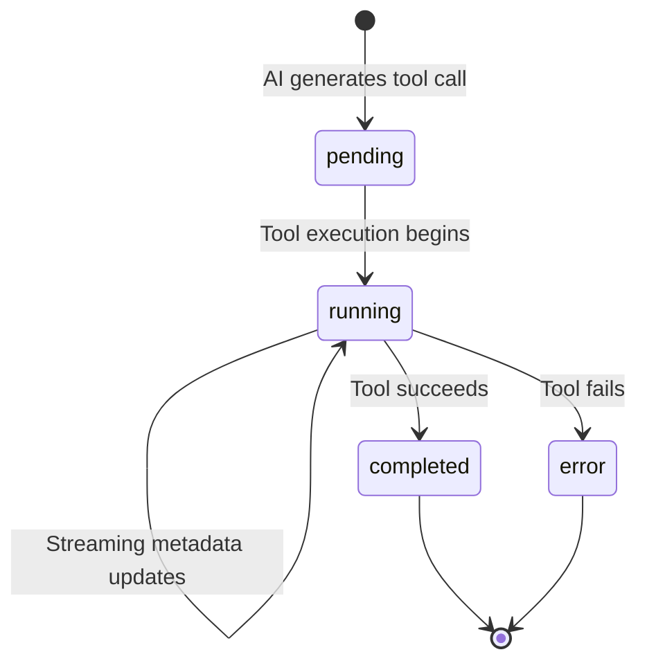

# OpenCode Tool Call Streaming and Rendering Analysis

## Executive Summary

This document provides a comprehensive analysis of how OpenCode TUI handles tool calls, their streaming responses, and visualization patterns. This analysis focuses on the complete lifecycle of tool execution from initiation through completion, with special attention to file operations, todo management, and real-time streaming mechanisms.

## Tool Call Architecture Overview

### Tool Lifecycle States



### Protocol-Level Tool Structure

```typescript
interface ToolCall {
  id: string
  type: string          // Tool name (read, write, edit, bash, etc.)
  parameters: object    // Tool-specific parameters
  state: {
    status: "pending" | "running" | "completed" | "error"
    metadata?: object   // Tool-specific rendering data
    error?: string      // Error message if failed
  }
}
```

## Tool Implementation Patterns

### 1. Core Tool Definition Pattern

All tools follow a standardized implementation pattern:

```typescript
const ToolName = Tool.define("tool-id", async () => ({
  description: await ToolDescription.loadDescription("tool-id", DESCRIPTION),
  parameters: z.object({
    // Zod schema for parameter validation
    param1: z.string(),
    param2: z.boolean().optional(),
  }),
  async execute(params, ctx) {
    // Implementation logic with streaming support
    ctx.metadata({ 
      title: "Tool Status", 
      metadata: { progress: 0.5 } 
    })
    
    return {
      title: string,      // Display title for TUI
      metadata: object,   // Structured data for rendering
      output: string      // Text output for AI model
    }
  }
}))
```

### 2. Context API for Real-time Updates

Tools receive a context object that enables streaming updates:

```typescript
interface ToolContext {
  sessionID: string
  messageID: string
  agent: string
  callID?: string
  abort: AbortSignal
  
  // Method to stream metadata updates
  metadata(update: { 
    title?: string
    metadata?: object 
  }): void
}
```

**Real-time Streaming Example (Bash Tool):**
```typescript
process.stdout?.on("data", (chunk) => {
  output += chunk.toString()
  ctx.metadata({
    metadata: {
      output: output,
      description: params.description,
    },
  })
})
```

### 3. Provider-Specific Parameter Handling

The tool registry implements provider-specific transformations:

```typescript
// OpenAI/Azure: Convert optional fields to nullable
const openaiParams = optionalToNullable(baseSchema)

// Google Gemini: Remove unsupported schema features  
const geminiParams = sanitizeGeminiParameters(baseSchema)

// Anthropic: Use schema directly
const anthropicParams = baseSchema
```

## File Operation Tool Analysis

### Write Tool Implementation

**Core Functionality:**
- Absolute path validation and normalization
- File existence checking with `FileTime.assert()`
- Permission system integration for file operations
- LSP integration for syntax validation
- Real-time diagnostic reporting

**Key Implementation Details:**
```typescript
async execute(params, ctx) {
  // Validate file path and permissions
  const filepath = Path.resolve(params.filePath)
  await FileTime.assert(filepath)
  
  // Write file content
  await fs.writeFile(filepath, params.content)
  
  // Check for syntax errors via LSP
  const diagnostics = await LSP.diagnostics()
  
  // Format diagnostic output
  let output = `File written to ${filepath}`
  if (diagnostics[filepath]?.length > 0) {
    output += `\nThis file has errors, please fix\n<file_diagnostics>\n`
    output += diagnostics[filepath].map(LSP.Diagnostic.pretty).join("\n")
    output += `\n</file_diagnostics>\n`
  }
  
  return {
    title: `Write ${Path.basename(filepath)}`,
    metadata: {
      filePath: filepath,
      preview: params.content.slice(0, 1000),
      diagnostics: diagnostics[filepath] || []
    },
    output
  }
}
```

### Edit Tool Implementation

**Advanced String Replacement Strategy:**
The edit tool implements a sophisticated fallback system for text replacement:

1. **SimpleReplacer** - Direct string matching
2. **LineTrimmedReplacer** - Line-by-line with trimming
3. **BlockAnchorReplacer** - Context-aware with similarity scoring
4. **WhitespaceNormalizedReplacer** - Flexible whitespace handling
5. **IndentationFlexibleReplacer** - Indentation-agnostic matching

**Diff Generation and Visualization:**
```typescript
// Generate unified diff
const diff = createTwoFilesPatch(
  filePath, filePath, 
  contentOld, contentNew,
  oldHeader, newHeader
)

// Return structured metadata for TUI rendering
return {
  title: `Edit ${Path.basename(filePath)}`,
  metadata: {
    filePath,
    diff: diff,
    oldContent: contentOld,
    newContent: contentNew,
    replacements: replacementCount
  },
  output: `Applied ${replacementCount} replacements in ${filePath}`
}
```

### Read Tool Implementation

**File Content Rendering:**
```typescript
return {
  title: `Read ${Path.basename(filePath)}`,
  metadata: {
    filePath,
    preview: content,
    size: stats.size,
    mtime: stats.mtime
  },
  output: content
}
```

## Todo Operation Implementation

### Todo State Management

**Session-Scoped State Storage:**
```typescript
const state = Instance.state(() => {
  const todos: { [sessionId: string]: TodoInfo[] } = {}
  return todos
})

const TodoInfo = z.object({
  content: z.string(),
  status: z.enum(["pending", "in_progress", "completed", "cancelled"]),
  priority: z.enum(["high", "medium", "low"]).optional(),
  id: z.string(),
})
```

### TodoWrite Tool Implementation

**Dynamic Todo Management:**
```typescript
async execute(params, ctx) {
  const sessionTodos = state[ctx.sessionID] || []
  
  // Update existing todos or add new ones
  const updatedTodos = params.todos.map(todo => ({
    ...todo,
    id: todo.id || generateId()
  }))
  
  state[ctx.sessionID] = updatedTodos
  
  // Detect operation type (create, update, etc.)
  const phase = detectPhase(sessionTodos, updatedTodos)
  
  return {
    title: phase, // "Creating plan", "Updating plan", etc.
    metadata: {
      todos: updatedTodos,
      phase,
      changes: getChanges(sessionTodos, updatedTodos)
    },
    output: formatTodosForAI(updatedTodos)
  }
}
```

### TodoRead Tool Implementation

**Todo Retrieval and Formatting:**
```typescript
async execute(params, ctx) {
  const todos = state[ctx.sessionID] || []
  
  return {
    title: "Current todos",
    metadata: {
      todos,
      count: todos.length,
      completed: todos.filter(t => t.status === "completed").length
    },
    output: formatTodosForAI(todos)
  }
}
```

## TUI Rendering and Visualization

### Tool Display Strategies

**Conditional Rendering Logic:**
```go
// Tools can be completely hidden from UI
if isIgnoredTool(toolType) {
    return "", nil
}

// Different rendering based on tool state
switch toolCall.State.Status {
case opencode.ToolPartStateStatusPending:
    return renderPendingTool(toolCall)
case opencode.ToolPartStateStatusRunning:
    return renderRunningTool(toolCall)
case opencode.ToolPartStateStatusCompleted:
    return renderCompletedTool(toolCall)
case opencode.ToolPartStateStatusError:
    return renderErrorTool(toolCall)
}
```

### Tool-Specific Rendering Patterns

#### File Operations Rendering

**Read Tool Display:**
```go
case "read":
    if preview := metadata["preview"]; preview != nil {
        filename := toolInputMap["filePath"].(string)
        body = preview.(string)
        body = util.RenderFile(filename, body, width, util.WithTruncate(6))
    }
```

**Edit Tool Diff Display:**
```go
case "edit":
    if diffField := metadata["diff"]; diffField != nil {
        patch := diffField.(string)
        formattedDiff, _ := diff.FormatUnifiedDiff(filename, patch, 
            diff.WithWidth(width-2))
        body = strings.TrimSpace(formattedDiff)
    }
```

**Write Tool Content Display:**
```go
case "write":
    if preview := metadata["preview"]; preview != nil {
        filename := toolInputMap["filePath"].(string)
        body = preview.(string)
        body = util.RenderFile(filename, body, width, util.WithTruncate(6))
    }
```

#### Bash Tool Console Rendering

```go
case "bash":
    body = fmt.Sprintf("```console\n$ %s\n", command)
    if output := metadata["output"]; output != nil {
        body += ansi.Strip(fmt.Sprintf("%s", output))
    }
    body += "```"
    body = util.ToMarkdown(body, width, backgroundColor)
```

#### Todo Operations Rendering

**TodoWrite Display:**
```go
case "todowrite":
    for _, item := range todos.([]any) {
        todo := item.(map[string]any)
        content := todo["content"].(string)
        
        switch todo["status"] {
        case "completed":
            body += fmt.Sprintf("- [x] %s\n", content)
        case "cancelled":
            body += fmt.Sprintf("- [ ] ~~%s~~\n", content) // Strike-through
        case "in_progress":
            body += fmt.Sprintf("- [ ] `%s`\n", content)   // Code highlighting
        default:
            body += fmt.Sprintf("- [ ] %s\n", content)
        }
    }
```

**TodoRead Display:**
```go
// TodoRead is typically ignored and doesn't display in TUI
case "todoread":
    return "", nil
```

### Animation and Real-time Updates

#### Shimmer Animation System

**Global Animation Coordination:**
```go
// Animation timing
const shimmerInterval = 90 * time.Millisecond

// Animation state detection
func (a *App) HasAnimatingWork() bool {
    // Check for pending/running tools in any message
    for _, message := range a.Messages {
        if hasUncompletedTools(message) {
            return true
        }
    }
    return false
}

// Shimmer rendering
func renderShimmer(text string, startTime time.Time, bgColor lipgloss.Color) string {
    elapsed := time.Since(startTime)
    // Implement sweeping highlight effect
    return applyShimmerEffect(text, elapsed, bgColor)
}
```

#### Real-time Update Flow

**Server-Sent Events Integration:**
```go
// Event types for tool updates
case opencode.EventListResponseEventMessagePartUpdated:
    // Tool status or metadata changed
    a.InvalidateCache(msg.Properties.MessageID)
    return a, tea.Batch(renderView(), startAnimationIfNeeded())

case opencode.EventListResponseEventMessagePartRemoved:
    // Tool was removed (e.g., error recovery)
    a.InvalidateCache(msg.Properties.MessageID)
    return a, renderView()
```

### Tool Detail Toggle System

**Toggle Implementation:**
```go
case ToggleToolDetailsMsg:
    a.app.State.ShowToolDetails = !a.app.State.ShowToolDetails
    a.app.State.Save()
    a.InvalidateAllCaches() // Force re-render
    return a, renderView()
```

**Conditional Detail Display:**
```go
func renderTool(tool ToolCall, showDetails bool) string {
    if !showDetails {
        // Compact mode: show only summary
        return fmt.Sprintf("∟ %s %s", tool.Type, getToolSummary(tool))
    }
    
    // Detailed mode: show full tool block
    return renderFullToolBlock(tool)
}
```

## Streaming and Real-time Communication

### Server-to-TUI Event Pipeline

**SSE Event Stream:**
```typescript
// Server endpoint for event streaming
app.get("/event", async (c) => {
  return streamSSE(c, async (stream) => {
    const unsub = Bus.subscribeAll(async (event) => {
      await stream.writeSSE({
        data: JSON.stringify(event),
      })
    })
    
    // Cleanup on disconnect
    return () => unsub()
  })
})
```

**Critical Event Types:**
- `message.part.updated` - Tool state or metadata changes
- `message.part.removed` - Tool removal (error recovery)
- `message.updated` - Message-level changes
- `session.updated` - Session metadata changes

### Tool Metadata Streaming

**Streaming Update Pattern:**
```typescript
// Tools can stream updates during execution
async function longRunningTool(params, ctx) {
  for (let i = 0; i < 100; i++) {
    await processStep(i)
    
    // Stream progress updates
    ctx.metadata({
      title: `Processing step ${i}/100`,
      metadata: { 
        progress: i / 100,
        currentStep: `Step ${i}` 
      }
    })
  }
  
  return finalResult
}
```

**TUI Response to Streaming:**
```go
// TUI receives metadata updates via SSE
case opencode.EventListResponseEventMessagePartUpdated:
    part := msg.Properties.Part
    if part.Type == opencode.MessagePartTypeTool {
        // Update tool display with new metadata
        a.InvalidateCache(msg.Properties.MessageID)
        return a, tea.Batch(
            renderView(),
            startAnimationIfNeeded(),
        )
    }
```

## Error Handling and Recovery

### Tool-Level Error Handling

**Error State Rendering:**
```go
if toolCall.State.Status == opencode.ToolPartStateStatusError {
    errorContent := styles.NewStyle().
        Width(width - 6).
        Foreground(theme.Error()).
        Background(backgroundColor).
        Render(toolCall.State.Error)
    
    if body == "" {
        body = errorContent
    } else {
        body += "\n\n" + errorContent
    }
}
```

**Error Recovery Patterns:**
- Tools can retry failed operations
- Error messages are displayed prominently in red
- Tool state can transition from error back to running on retry

### Permission System Integration

**Permission Workflow:**
```go
// Tools check permissions before execution
if agent.permission.edit === "deny" {
    return PermissionDeniedError
}

// UI displays permission requests
if currentPermission.ID != "" {
    return renderPermissionPrompt(currentPermission)
}
```

**Permission UI:**
```go
permissionPrompt := "Permission required to run this tool:\n\n"
permissionPrompt += "enter accept   a accept always   esc reject"
```

## Performance Optimizations

### Caching Strategy

**Multi-layered Caching:**
```go
// Cache key includes all rendering parameters
key := cache.GenerateKey(
    messageID,
    toolID, 
    showToolDetails,
    width,
    permissionID,
    themeID,
)

// Cache invalidation on state changes
func (a *App) InvalidateCache(messageID string) {
    a.cache.InvalidateByPrefix(messageID)
}
```

### Output Truncation

**Content Limiting:**
```go
// Limit tool output display height
body = util.TruncateHeight(body, 10)

// File preview truncation
body = util.RenderFile(filename, content, width, 
    util.WithTruncate(6)) // Show first 6 lines
```

### Animation Optimization

**Efficient Animation Cycles:**
```go
// Only animate when needed
if a.HasAnimatingWork() {
    return tea.Tick(shimmerInterval, func(t time.Time) tea.Msg {
        return AnimationTickMsg{Time: t}
    })
}

// Stop animations when work completes
case AnimationTickMsg:
    if !a.HasAnimatingWork() {
        return a, nil // Stop animation loop
    }
    return a, tea.Batch(renderView(), nextAnimationTick())
```

## HTML Implementation Guidelines

### Component Architecture for Web

```typescript
// Tool component hierarchy
interface ToolCallComponent {
  id: string
  type: string
  status: ToolStatus
  metadata?: object
  showDetails: boolean
  onToggleDetails: () => void
}

// Specialized tool renderers
const toolRenderers = {
  read: FileReadRenderer,
  write: FileWriteRenderer,
  edit: FileDiffRenderer,
  bash: ConsoleOutputRenderer,
  todowrite: TodoListRenderer,
  todoread: TodoSummaryRenderer,
}
```

### Real-time Updates Implementation

```typescript
// WebSocket/SSE event handling
useEffect(() => {
  const eventSource = new EventSource('/api/events')
  
  eventSource.onmessage = (event) => {
    const data = JSON.parse(event.data)
    
    if (data.type === 'message.part.updated' && data.part.type === 'tool') {
      updateToolState(data.part.id, data.part.state)
    }
  }
  
  return () => eventSource.close()
}, [])
```

### Animation System for Web

```css
/* Shimmer animation */
@keyframes shimmer {
  0% { background-position: -200% 0; }
  100% { background-position: 200% 0; }
}

.tool-pending .tool-title {
  background: linear-gradient(90deg, 
    transparent, 
    rgba(255,255,255,0.2), 
    transparent);
  background-size: 200% 100%;
  animation: shimmer 2.5s infinite;
}
```

### State Management for Tools

```typescript
// Tool state management with Zustand
interface ToolStore {
  tools: Record<string, ToolCall>
  showDetails: boolean
  updateTool: (id: string, update: Partial<ToolCall>) => void
  toggleDetails: () => void
}

const useToolStore = create<ToolStore>((set) => ({
  tools: {},
  showDetails: true,
  updateTool: (id, update) => 
    set((state) => ({
      tools: {
        ...state.tools,
        [id]: { ...state.tools[id], ...update }
      }
    })),
  toggleDetails: () => 
    set((state) => ({ showDetails: !state.showDetails }))
}))
```

## Conclusion

OpenCode's tool system demonstrates sophisticated real-time communication patterns, intelligent caching strategies, and rich visualization capabilities. The analysis reveals:

1. **Standardized Tool Protocol** - Consistent implementation patterns across all tools
2. **Real-time Streaming** - Server-sent events enable live updates during tool execution
3. **Rich Visualization** - Tool-specific rendering with syntax highlighting and diff displays
4. **Performance Optimization** - Multi-layered caching and animation management
5. **Error Handling** - Graceful degradation with prominent error display
6. **Permission Integration** - Security-conscious execution with user approval flows

These patterns provide an excellent foundation for implementing a web-based version that maintains functional parity while leveraging modern web technologies for enhanced user experience and broader accessibility.

The key insight is that the tool system is designed as a streaming, event-driven architecture that can be effectively replicated in HTML using WebSocket/SSE connections, modern JavaScript frameworks, and CSS animations, while maintaining the same level of functionality and user experience as the native TUI implementation.