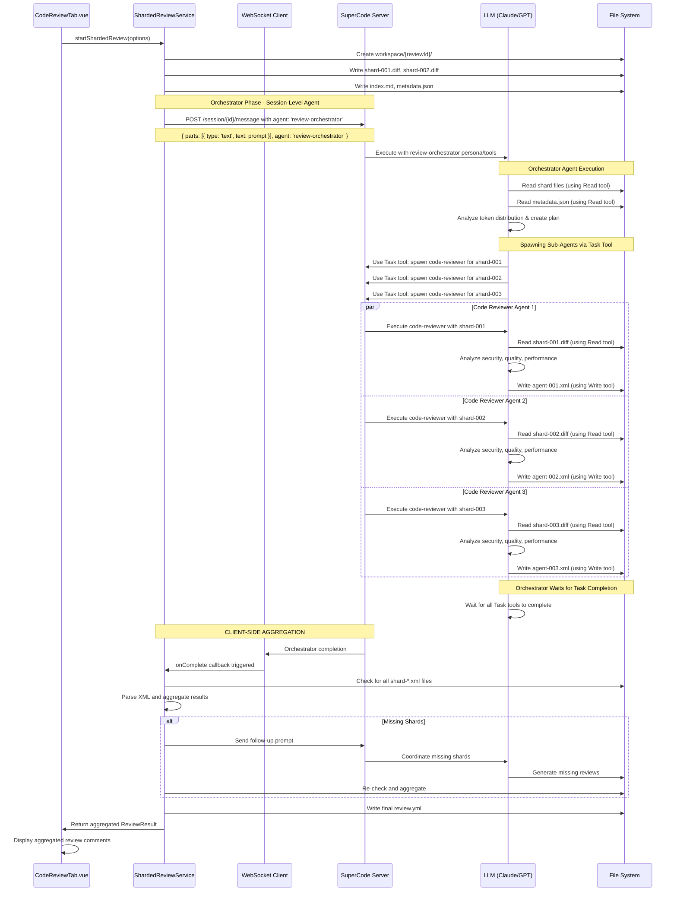
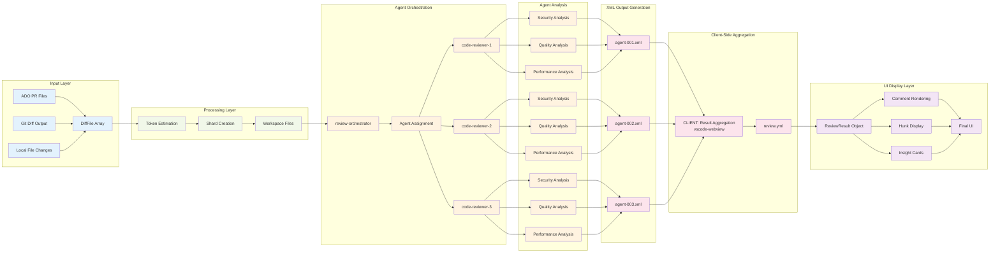
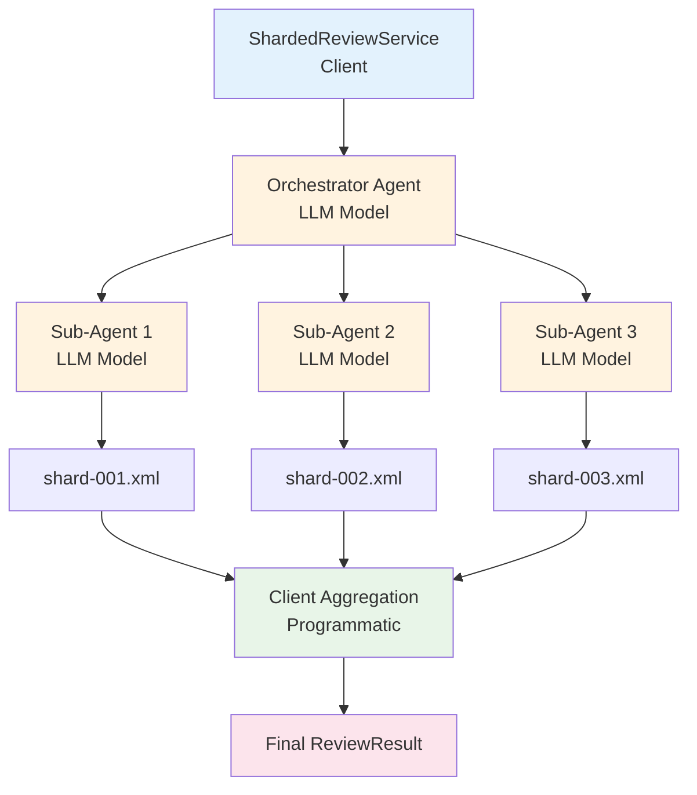

# Sharded Code Review System

Scalable code review architecture for large changesets using parallel agent processing.

## Overview

The sharded code review system enables efficient review of large changesets by splitting them into manageable shards and processing them in parallel using specialized agents. This approach optimizes token usage while maintaining thorough review quality.

---

## Architecture

### Core Components

**Review Orchestrator Agent** (`.opencode/agent/review-orchestrator.md`)
- Manages large-scale review coordination
- Creates optimal shard distribution
- Spawns and monitors parallel review agents
- Aggregates results into unified output

**Code Reviewer Agent** (`.opencode/agent/code-reviewer.md`)
- Conducts focused review on assigned shards
- Provides structured analysis in XML format
- Focuses on security, quality, and maintainability
- Outputs results for orchestrator aggregation

**Shard Output Style** (`.opencode/output-styles/code-review-shard.md`)
- Ensures consistent XML formatting across agents
- Enables proper result aggregation
- Defines review standards and comment types

---

## File Structure

The system supports both feature-specific and adhoc reviews with hierarchical organization:

```
.supercode-project/
├── adhoc/                         # Adhoc reviews (no feature context)
│   └── reviews/
│       ├── review-{timestamp}-{hash}/
│       │   ├── index.md           # Progress tracking with checkboxes
│       │   ├── metadata.json      # Review configuration and state
│       │   ├── shards/            # Individual diff files
│       │   │   ├── shard-001.diff
│       │   │   ├── shard-002.diff
│       │   │   └── shard-003.diff
│       │   └── results/           # Agent outputs
│       │       ├── shard-001-review.xml
│       │       ├── shard-002-review.xml
│       │       └── review.yml     # Final aggregated results
│       └── review-{timestamp2}-{hash2}/
├── features/                      # Feature-specific reviews
│   ├── <feature-name>/
│   │   └── reviews/
│   │       ├── review-{timestamp}-{hash}/
│   │       │   ├── index.md
│   │       │   ├── metadata.json
│   │       │   ├── shards/
│   │       │   └── results/
│   │       └── review-{timestamp2}-{hash2}/
│   └── <another-feature>/
│       └── reviews/
└── active-reviews.json           # Registry tracking both adhoc and feature reviews
```

### Workspace Isolation

**Unique Review IDs**: Each review gets a unique identifier combining:
- Timestamp (ISO format for sorting)
- Content hash (first 8 chars of diff content hash)
- Example: `review-2024-01-15T10-30-45-a1b2c3d4`

**Review Types and Paths**:
- **Adhoc Reviews**: `.supercode-project/adhoc/reviews/{review-id}/`
- **Feature Reviews**: `.supercode-project/features/{feature-name}/reviews/{review-id}/`

**Active Review Registry**: Central registry tracks both review types:
```json
{
  "active": [
    {
      "id": "review-2024-01-15T10-30-45-a1b2c3d4",
      "type": "adhoc",
      "path": "adhoc/reviews/review-2024-01-15T10-30-45-a1b2c3d4",
      "created": "2024-01-15T10:30:45Z",
      "status": "in_progress",
      "totalShards": 4,
      "completedShards": 2,
      "branch": "feature/auth-improvements",
      "feature": null
    },
    {
      "id": "review-2024-01-15T11-20-15-b3c4d5e6",
      "type": "feature",
      "path": "features/user-dashboard/reviews/review-2024-01-15T11-20-15-b3c4d5e6",
      "created": "2024-01-15T11:20:15Z",
      "status": "in_progress",
      "totalShards": 6,
      "completedShards": 3,
      "branch": "feature/dashboard-ui",
      "feature": "user-dashboard"
    }
  ],
  "completed": [...],
  "failed": [...]
}
```

---

## Execution Flow Diagram

```mermaid
graph TD
    A[User Initiates Review] --> B{Review Type?}
    B -->|Large Changeset| C[ShardedReviewService]
    B -->|Standard Review| Z[Standard CodeReviewService]

    C --> D[Generate Review ID<br/>review-timestamp-hash]
    D --> E{Feature Selected?}
    E -->|Yes| F1[Create Feature Workspace<br/>.supercode-project/features/feature-name/reviews/reviewId/]
    E -->|No| F2[Create Adhoc Workspace<br/>.supercode-project/adhoc/reviews/reviewId/]
    F1 --> G[Register in Active Registry<br/>active-reviews.json with type: feature]
    F2 --> H[Register in Active Registry<br/>active-reviews.json with type: adhoc]
    G --> I{Diff Source?}
    H --> I

    I -->|Azure DevOps| J[ADOContentService<br/>Fetch PR Diffs]
    I -->|Git Local| K[Git Command<br/>git diff branch1..branch2]

    J --> L[DiffFile Array]
    K --> L

    L --> M[Token Estimation<br/>~4 chars per token]
    M --> N[Create Shards<br/>6K-8K tokens each]
    N --> O[Write Shard Files<br/>shard-001.diff, shard-002.diff]

    O --> P[Create Index File<br/>index.md with checkboxes]
    P --> Q[Create Metadata<br/>metadata.json]

    Q --> R[Start Review Orchestrator<br/>Session-Level Agent]
    R --> S[review-orchestrator LLM]

    S --> T[Read Shard Files<br/>Analyze complexity & token distribution]
    T --> U[Create Agent Assignment Plan<br/>Balance token load across reviewers]

    U --> V1[Execute Task Tool<br/>code-reviewer for shard-001]
    U --> V2[Execute Task Tool<br/>code-reviewer for shard-002]
    U --> V3[Execute Task Tool<br/>code-reviewer for shard-003]

    V1 --> W1[LLM Reviews Shard 1<br/>code-review-shard output style]
    V2 --> W2[LLM Reviews Shard 2<br/>code-review-shard output style]
    V3 --> W3[LLM Reviews Shard 3<br/>code-review-shard output style]

    W1 --> X1[Write XML Output<br/>shard-001-review.xml]
    W2 --> X2[Write XML Output<br/>shard-002-review.xml]
    W3 --> X3[Write XML Output<br/>shard-003-review.xml]

    X1 --> Y[Task Tools Complete<br/>Return to Orchestrator]
    X2 --> Y
    X3 --> Y

    Y --> Z[CLIENT: Check for all shard result files<br/>vscode-webview validation]

    Z --> AA[CLIENT: Parse XML files<br/>Read and validate shard-*.xml]
    AA --> BB[CLIENT: Aggregate results<br/>Merge insights, hunks, comments]
    BB --> CC{All shards complete?}

    CC -->|Missing shards| DD[CLIENT: Send follow-up prompt<br/>Ask orchestrator to complete missing shards]
    DD --> Y
    CC -->|All complete| EE[CLIENT: Generate review.yml<br/>Final aggregated results]

    EE --> FF[CLIENT: Mark review complete<br/>Update registry status]
    FF --> GG[ShardedReviewService<br/>Return ReviewResult]

    GG --> HH[CodeReviewTab.vue<br/>Display Results]
    HH --> II[Render Review Comments<br/>By file and line number]
    II --> JJ[Render Insights<br/>Security & quality issues]
    JJ --> KK[Render Hunks<br/>Change analysis with risk levels]

    KK --> LL[Final UI Display<br/>Interactive review interface]

    %% Styling
    classDef userAction fill:#e1f5fe
    classDef service fill:#f3e5f5
    classDef agent fill:#e8f5e8
    classDef file fill:#fff3e0
    classDef ui fill:#fce4ec

    class A,B userAction
    class C,I,J,K,GG service
    class R,S,V1,V2,V3,W1,W2,W3 agent
    class F1,F2,L,O,P,Q,X1,X2,X3,EE file
    class HH,II,JJ,KK,LL ui
```



## Agent Execution Details

### SuperCode WebSocket Integration



### Data Flow Through Agent Layers



## Process Flow

### 1. Detection & Initialization

The vscode-webview determines when to use sharded review:
- More than 5 files changed
- Estimated token count exceeds 20,000
- User explicitly selects "Sharded Review" option

### 2. Orchestration Phase

The review orchestrator (LLM agent):
1. Analyzes the diff and creates optimal shards (6K-8K tokens each)
2. Generates workspace registry with shard metadata
3. Uses Task tool to spawn code-reviewer agents for each shard
4. Task tool executes sub-agents synchronously and waits for completion

### 3. Parallel Review Phase (via Task Tool)

Each code-reviewer agent (LLM execution):
1. Receives assigned shard and analyzes code changes
2. Uses code-review-shard output style for structured XML generation
3. Conducts security, quality, and performance analysis
4. Writes XML results to designated shard result file

### 4. Client-Side Aggregation Phase

The ShardedReviewService (client) handles all aggregation:
1. **Agent Completion**: Orchestrator agent execution completes (no aggregation by agent)
2. **File Validation**: Client programmatically checks for all expected shard-*.xml files
3. **XML Parsing**: Client reads and parses XML content from each shard result
4. **Result Merging**: Client aggregates hunks and comments into unified ReviewResult
5. **Missing Shard Handling**: If files are missing, client sends follow-up prompt to orchestrator
6. **Final Output**: Client generates review.yml and updates vscode-webview UI

**Why Client-Side Aggregation?**
- Agent context window cannot fit all shard results
- More efficient programmatic file checking vs. LLM file reading
- Cleaner separation of concerns: agents generate, client aggregates
- Enables robust error handling and retry logic
- vscode-webview validates that all shard review files are generated

---

## Architecture Correction Summary

### Key Design Principle: Client-Agent Separation

**What Changed:** Initially, the design incorrectly assumed the orchestrator agent would aggregate results by reading all shard files. This was problematic because:
- LLM context window cannot fit all shard results
- Agent would need to re-read and process large amounts of data
- Creates unnecessary complexity in agent prompts

**Corrected Architecture:**



**Role Clarity:**
- **Client**: File management, aggregation, error handling, UI updates
- **Orchestrator Agent**: Coordination and sub-agent spawning only
- **Sub-Agents**: Focused code analysis and XML generation only

---

## Integration Points

### VSCode Extension

**CodeReviewTab.vue Updates**
- New review type: "Sharded Review (Large Changes)"
- Real-time progress visualization from index.md
- Standard results display using aggregated data

**ShardedReviewService.ts**
- Extends existing CodeReviewService
- Implements orchestration logic
- Manages agent coordination and result aggregation

### SuperCode Integration

**Agent Execution**
```typescript
// Execute with session-level agent specification (NOT TUI-level setAgent)
private async executeWithSessionAgent(agentName: string, prompt: string, callbacks: any) {
  const sessionId = this.sessionManager.getCurrentSessionId()

  // Use session API directly with agent specification
  const response = await fetch(`${this.sessionManager.getBaseUrl()}/session/${sessionId}/message`, {
    method: 'POST',
    headers: { 'Content-Type': 'application/json' },
    body: JSON.stringify({
      parts: [{ type: 'text', text: prompt }],
      agent: agentName  // Session-level agent specification
    })
  })

  // Process streaming response
  await this.sessionManager.processStreamingResponse(response, {
    sessionId,
    callbacks,
    includeSessionFilter: true
  })
}

// Usage
await this.executeWithSessionAgent('review-orchestrator', orchestratorPrompt, {
  onComplete: (fullContent) => {
    // Agent execution complete - proceed to client-side aggregation
    this.checkAndAggregateResults(shards)
  }
})
```

**Completion Detection**
- Uses WebSocket streaming with `onComplete` callback - no polling required
- Orchestrator agent executes tools (Task tool) to spawn sub-agents synchronously
- Sub-agent completion detected through file system results rather than active monitoring
- Aggregation triggers automatically when orchestrator execution completes

---

## XML Output Format

Each code-reviewer agent produces structured XML:

```xml
<code-review shard-id="shard-001" reviewer-id="agent-001">
<insights>
  <insight type="security" severity="high">
    Potential XSS vulnerability in user input handling
  </insight>
</insights>

<hunks>
  <hunk file="src/components/UserInput.vue" start="45" end="60">
    <category>security-fix</category>
    <risk>high</risk>
    <description>Input validation missing for user-generated content</description>
    <needs-attention>yes</needs-attention>
  </hunk>
</hunks>

<comments>
  <comment>
    <file>src/components/UserInput.vue</file>
    <lines start="52" end="55"/>
    <type>issue</type>
    <severity>high</severity>
    <message>User input is directly interpolated without sanitization</message>
    <fix-code>
```javascript
// Sanitize user input before rendering
const sanitizedInput = DOMPurify.sanitize(userInput)
```
    </fix-code>
  </comment>
</comments>
</code-review>
```

---

## Usage Examples

### Automatic Detection
```typescript
// Large changeset automatically triggers sharded review
if (diffFiles.length > 5 || estimatedTokens > 20000) {
  reviewService = new ShardedReviewService(wsClient)
  await reviewService.startShardedReview(options)
}
```

### Manual Invocation
```typescript
// User explicitly selects sharded review
const reviewType = 'sharded'
const shardedService = new ShardedReviewService(wsClient)
await shardedService.startShardedReview({
  diffFiles: largeChangeset,
  maxTokensPerAgent: 8000,
  maxConcurrentAgents: 3
})
```

### Progress Tracking
```markdown
# Code Review Progress

## Review Status: In Progress (75% Complete)
**Review ID:** review-2024-01-15T10-30-45-a1b2c3d4

### Shard Distribution
- [x] **shard-001** (UserInput.vue) - ~2,500 tokens → Agent-1 ✅
- [x] **shard-002** (AuthService.ts) - ~4,200 tokens → Agent-1 ✅
- [x] **shard-003** (ReviewTypes.ts) - ~800 tokens → Agent-2 ✅
- [ ] **shard-004** (ShardedService.ts) - ~3,100 tokens → Agent-2

### Summary
- **Total Shards:** 4
- **Completed:** 3/4 (75%)
- **Active Agents:** 1
```

### Concurrent Review Management

**Managing Multiple Reviews with Feature Context**:
```typescript
// Start adhoc review (no feature context)
const adhocReview = new ShardedReviewService(wsClient)
await adhocReview.startShardedReview({
  diffFiles: hotfixFiles,
  reviewType: 'adhoc'
})

// Start feature-specific review
const featureReview = new ShardedReviewService(wsClient)
await featureReview.startShardedReview({
  diffFiles: featureFiles,
  reviewType: 'feature',
  featureName: 'user-dashboard'
})

// Monitor all active reviews (both types)
const activeReviews = await adhocReview.getActiveReviews()
console.log(`Adhoc reviews: ${activeReviews.active.filter(r => r.type === 'adhoc').length}`)
console.log(`Feature reviews: ${activeReviews.active.filter(r => r.type === 'feature').length}`)
```

**Workspace Organization**:
```typescript
// Adhoc review path
const adhocPath = '.supercode-project/adhoc/reviews/review-2024-01-15T10-30-45-a1b2c3d4'

// Feature review path
const featurePath = '.supercode-project/features/user-dashboard/reviews/review-2024-01-15T11-20-15-b3c4d5e6'

// Clean up old reviews (older than 24 hours) for both types
await shardedService.cleanupOldReviews(24)

// Clean up specific feature
await shardedService.cleanupFeatureReviews('user-dashboard')
```

---

## Benefits

### Scalability
- Handles changesets of any size through intelligent sharding
- Parallel processing reduces total review time
- Token optimization maximizes agent efficiency

### Quality
- Maintains thorough review standards across all shards
- Consistent output formatting enables proper aggregation
- Specialized agents focus on their assigned scope

### User Experience
- Familiar interface with real-time progress updates
- Standard result presentation in CodeReviewTab
- Seamless integration with existing workflows

---

## Configuration

### Agent Settings
- **Max Tokens Per Agent**: 8,000 (configurable)
- **Max Concurrent Agents**: 3 (configurable)
- **Shard Size Target**: 6K-8K tokens per shard
- **Review Timeout**: 10 minutes per shard

### File Patterns
- **Include**: All changed files in diff
- **Exclude**: Generated files, lock files, large binary assets
- **Prioritize**: Security-sensitive files, core business logic

### Output Management
- **Hierarchical Organization**: Feature-specific and adhoc review separation
- **Isolated Workspaces**: Each review gets unique directory with collision-free naming
- **Active Review Registry**: Central tracking of both review types with status management
- **Feature Context**: Reviews organized by feature for better project management
- **Auto-cleanup**: Review workspaces cleaned after 24 hours via `cleanupOldReviews()`
- **Result Retention**: Aggregated results saved to review history within feature context
- **Error Handling**: Failed shards retried with different agent assignment
- **Concurrent Support**: Multiple reviews can run simultaneously without interference

### File Structure Benefits
- **Feature Organization**: Related reviews grouped under feature directories
- **Adhoc Flexibility**: Quick reviews without feature overhead
- **Project Context**: Clear separation between planned feature work and adhoc fixes
- **Historical Tracking**: Easy to find past reviews for specific features
- **Cleanup Efficiency**: Can clean up all reviews for a specific feature at once

This design enables SuperCode to handle large-scale code reviews efficiently while maintaining the high-quality analysis users expect from individual file reviews.