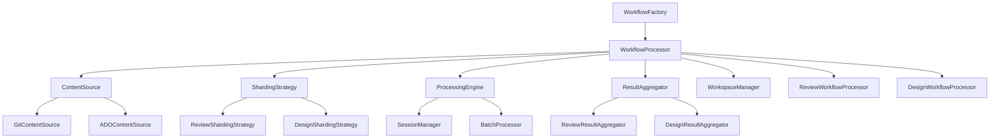

# Architecture Overview

## 🏗️ System Architecture

The Project Workflow Module is designed as a layered, modular system that extracts and generalizes the core logic from `scripts/sharded-review-parallel.js` into reusable, testable components.

## 📁 Module Structure

```
packages/project-workflow/
├── src/
│   ├── core/                    # Core abstractions and base classes
│   │   ├── WorkflowProcessor.ts         # Base workflow processor
│   │   ├── ContentSource.ts             # Content source abstraction
│   │   ├── ShardingStrategy.ts          # Content splitting strategies
│   │   ├── ProcessingEngine.ts          # Parallel execution engine
│   │   ├── ResultAggregator.ts          # Result transformation
│   │   └── WorkspaceManager.ts          # File/directory management
│   ├── review/                  # Review workflow implementation
│   │   ├── ReviewWorkflowProcessor.ts   # Review-specific processor
│   │   ├── ReviewShardingStrategy.ts    # File-boundary-aware sharding
│   │   ├── ReviewResultAggregator.ts    # XML→JSON transformation
│   │   └── ReviewPromptBuilder.ts       # Review-specific prompts
│   ├── sources/                 # Content source implementations
│   │   ├── GitContentSource.ts          # Git integration
│   │   └── ADOContentSource.ts          # ADO API integration
│   ├── types/                   # Type definitions
│   │   ├── WorkflowTypes.ts             # Core interfaces
│   │   ├── ReviewTypes.ts               # Review-specific types
│   │   └── SourceTypes.ts               # Content source types
│   ├── factory/                 # Factory implementations
│   │   └── WorkflowFactory.ts           # Workflow creation
│   └── index.ts                 # Public API exports
├── docs/                        # Documentation
├── test/                        # Unit tests
└── package.json
```

## 🔄 Component Relationships



## 🎯 Design Patterns

### 1. Strategy Pattern
Different algorithms for sharding, processing, and result aggregation can be plugged in based on workflow requirements.

```typescript
interface IShardingStrategy {
  createShards(content: SourceContent, config: ShardingConfig): Promise<Shard[]>
}

class FileBoundaryShardingStrategy implements IShardingStrategy {
  // File-boundary-aware sharding for code review
}

class TokenBasedShardingStrategy implements IShardingStrategy {
  // Token-based sharding for other workflows
}
```

### 2. Factory Pattern
Simplifies object creation and configuration management.

```typescript
class WorkflowFactory {
  static createReviewWorkflow(config: ReviewConfig): ReviewWorkflowProcessor {
    const contentSource = this.createContentSource(config.sourceType)
    const shardingStrategy = new FileBoundaryShardingStrategy()
    const processingEngine = new ProcessingEngine(config)
    const resultAggregator = new ReviewResultAggregator()
    const workspaceManager = new WorkspaceManager(config.workspace)

    return new ReviewWorkflowProcessor(
      contentSource,
      shardingStrategy,
      processingEngine,
      resultAggregator,
      workspaceManager
    )
  }
}
```

### 3. Template Method Pattern
Base workflow processor defines the common workflow steps, with subclasses providing specific implementations.

```typescript
abstract class WorkflowProcessor {
  async process(input: WorkflowInput, config: WorkflowConfig): Promise<WorkflowResult> {
    const content = await this.contentSource.fetchContent(input.identifier)
    const shards = await this.shardingStrategy.createShards(content, config.sharding)
    const results = await this.processingEngine.processShards(shards, this.createShardProcessor())
    const aggregated = await this.resultAggregator.aggregateResults(results, content.metadata)
    await this.workspaceManager.cleanup()
    return aggregated
  }

  protected abstract createShardProcessor(): ShardProcessor
}
```

### 4. Dependency Injection
Components receive their dependencies through constructor injection, enabling testing and flexibility.

```typescript
class ReviewWorkflowProcessor extends WorkflowProcessor {
  constructor(
    contentSource: IContentSource,
    shardingStrategy: IShardingStrategy,
    processingEngine: IProcessingEngine,
    resultAggregator: IResultAggregator,
    workspaceManager: IWorkspaceManager
  ) {
    super(contentSource, shardingStrategy, processingEngine, resultAggregator, workspaceManager)
  }
}
```

## 🔧 Core Components

### WorkflowProcessor
**Responsibility**: Orchestrates the entire workflow execution
**Key Features**:
- Defines common workflow steps
- Manages component coordination
- Handles error recovery and cleanup
- Provides extensibility points for subclasses

### ContentSource
**Responsibility**: Abstracts content retrieval from different sources
**Key Features**:
- Unified interface for Git, ADO, and future sources
- Input validation and normalization
- Metadata extraction and enrichment
- Caching and optimization

### ShardingStrategy
**Responsibility**: Intelligent content splitting for parallel processing
**Key Features**:
- Token-aware splitting algorithms
- File-boundary preservation
- Configurable size targets
- Context preservation across shards

### ProcessingEngine
**Responsibility**: Parallel execution with session management
**Key Features**:
- Concurrent processing with batching
- Session lifecycle management
- Resource optimization and cleanup
- Error handling and retry logic

### ResultAggregator
**Responsibility**: Transform and combine processing results
**Key Features**:
- Format-specific result parsing
- Intelligent result merging
- Threading and relationship preservation
- Quality validation and metrics

### WorkspaceManager
**Responsibility**: File system operations and cleanup
**Key Features**:
- Temporary workspace creation
- File organization and naming
- Automatic cleanup and error recovery
- Permission and security management

## 🚀 Extensibility Points

### Adding New Workflow Types
1. **Create workflow-specific processor**: Extend `WorkflowProcessor`
2. **Implement custom strategies**: Create specific sharding, processing, and aggregation strategies
3. **Define type interfaces**: Add workflow-specific types and configurations
4. **Update factory**: Add factory method for new workflow type

### Adding New Content Sources
1. **Implement `IContentSource`**: Create source-specific implementation
2. **Add source detection**: Update factory to recognize new source types
3. **Define source types**: Add type definitions for new source format
4. **Add validation**: Implement input validation for new source format

### Adding New Processing Strategies
1. **Implement strategy interface**: Create algorithm-specific implementation
2. **Add configuration options**: Define strategy-specific configuration
3. **Update factory logic**: Add strategy selection logic
4. **Add validation**: Implement strategy validation and error handling

## 🛡️ Error Handling Strategy

### Graceful Degradation
- **Partial Success**: Continue processing successful shards even if some fail
- **Resource Cleanup**: Ensure sessions and files are cleaned up on errors
- **Retry Logic**: Built-in retry with exponential backoff for transient failures
- **Fallback Strategies**: Alternative approaches when primary strategies fail

### Error Recovery
```typescript
try {
  const results = await this.processingEngine.processShards(shards, processor)
} catch (error) {
  // Log error details
  this.logger.error('Shard processing failed', { error, shardCount: shards.length })

  // Attempt partial recovery
  const partialResults = await this.processingEngine.getPartialResults()
  if (partialResults.length > 0) {
    this.logger.warn(`Recovered ${partialResults.length} of ${shards.length} results`)
    return await this.resultAggregator.aggregateResults(partialResults, metadata)
  }

  throw new WorkflowProcessingError('Complete processing failure', error)
}
```

## 📊 Performance Considerations

### Parallel Processing
- **Batched Execution**: Process shards in batches to manage server load
- **Resource Management**: Monitor and limit concurrent sessions
- **Intelligent Queuing**: Optimize shard ordering for better throughput

### Memory Management
- **Streaming Processing**: Process large files without loading entirely into memory
- **Incremental Cleanup**: Clean up resources as soon as they're no longer needed
- **Memory Monitoring**: Track memory usage and implement safeguards

### Caching Strategy
- **Session Reuse**: Reuse sessions when possible to reduce overhead
- **Content Caching**: Cache frequently accessed content and metadata
- **Result Caching**: Cache intermediate results for retry scenarios

## 🔍 Monitoring and Observability

### Metrics Collection
- **Processing Time**: Track workflow execution duration
- **Success Rates**: Monitor success/failure ratios
- **Resource Usage**: Track memory, CPU, and network usage
- **Error Patterns**: Identify common failure modes

### Logging Strategy
- **Structured Logging**: Use consistent log formats for automated analysis
- **Context Preservation**: Include relevant context in all log entries
- **Performance Logging**: Log key performance metrics and bottlenecks
- **Error Details**: Capture sufficient detail for troubleshooting